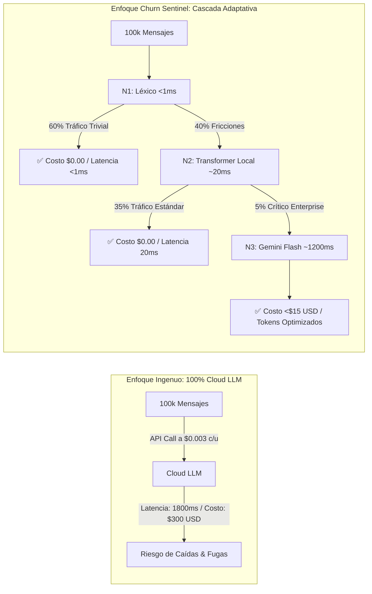

# 🎓 Guía Maestra de Sustentación Técnica (Nivel Senior / Staff Engineer)
**Proyecto: Churn Sentinel AI — Monitor de Sentimiento y Alertas de Riesgo de Abandono**

> 📄 **Ubicación Oficial en la Suite Documental:** [`docs/06_GUIA_SUSTENTACION_SENIOR.md`](file:///c:/Users/SEBAS/Desktop/Antigravit/HU_seman4_IA/docs/06_GUIA_SUSTENTACION_SENIOR.md)  
> 📖 **Documento Principal del Proyecto:** [`README.md`](file:///c:/Users/SEBAS/Desktop/Antigravit/HU_seman4_IA/README.md)

---

## 🎯 Presentación y Objetivo del Documento

Esta guía constituye el **Dossier Técnico y Estratégico de Defensa** para sustentar el proyecto ante comités evaluadores, directores de ingeniería ($VP\text{ of Engineering} / \text{CTO}$), arquitectos de software y líderes de producto. 

Su contenido sintetiza los fundamentos teóricos, decisiones de diseño, justificaciones $FinOps$, mitigación de riesgos de producción y respuestas preparadas ante preguntas de alta exigencia técnica.

---

## 📑 Tabla de Contenidos
1. [🎙️ Capítulo 1: Pitch Ejecutivo & Narrativa de Negocio (The 120-Second Pitch)](#️-cap%C3%ADtulo-1-pitch-ejecutivo--narrativa-de-negocio-the-120-second-pitch)
2. [🏛️ Capítulo 2: Defensa Arquitectónica de Profundidad (Senior Architecture Breakdown)](#️-cap%C3%ADtulo-2-defensa-arquitect%C3%B3nica-de-profundidad-senior-architecture-breakdown)
3. [🧠 Capítulo 3: Deep-Dive en el Pipeline de IA & Procesamiento NLP](#-cap%C3%ADtulo-3-deep-dive-en-el-pipeline-de-ia--procesamiento-nlp)
4. [⚙️ Capítulo 4: Deep-Dive en Backend, Persistencia y Motor Determinista](#️-cap%C3%ADtulo-4-deep-dive-en-backend-persistencia-y-motor-determinista)
5. [🛡️ Capítulo 5: Batería de 15 Preguntas Difíciles de Jurado con Respuestas Senior](#️-cap%C3%ADtulo-5-bater%C3%ADa-de-15-preguntas-dif%C3%ADciles-de-jurado-con-respuestas-senior)
6. [🎬 Capítulo 6: Guión y Libreto de Demostración en Vivo (Live Demo Script)](#-cap%C3%ADtulo-6-gui%C3%B3n-y-libreto-de-demostraci%C3%B3n-en-vivo-live-demo-script)
7. [⚡ Capítulo 7: Ficha Técnica Resumen (Cheat-Sheet de Estudio Rápido)](#-cap%C3%ADtulo-7-ficha-t%C3%A9cnica-resumen-cheat-sheet-de-estudio-r%C3%A1pido)

---

## 🎙️ Capítulo 1: Pitch Ejecutivo & Narrativa de Negocio (The 120-Second Pitch)

### ⏱️ El Discurso de 2 Minutos para el Jurado:

> *"Buenas tardes, miembros del comité. En la economía digital y los modelos de suscripción SaaS, adquirir un nuevo cliente cuesta **entre 5 y 7 veces más** que retener a uno existente. Sin embargo, más del **70% del churn de clientes ocurre en silencio**: el cliente experimenta fricciones recurrentes en facturación o soporte, se desmotiva y cancela el servicio antes de que la gerencia siquiera se entere.*
>
> *Para resolver esto presentamos **Churn Sentinel AI**, una plataforma de grado industrial diseñada para la **detección temprana y proactiva de riesgo de abandono** a partir de interacciones no estructuradas multicanal.*
>
> *A diferencia de soluciones ingenuas que intentan delegar todo el cálculo a costosas APIs de LLMs —conllevando altos costos, latencias inaceptables y riesgo de alucinaciones—, nuestro sistema implementa una **Arquitectura de Inferencia Adaptativa en 3 Niveles (Tiered Cascaded Architecture)** y un **Principio de Separación Estricto**:*
> 1. *La IA actúa como extractor semántico estructurado, resolviendo el 60% del tráfico a costo \$0 y $<1$ ms.*
> 2. *El Backend ejecuta un **Motor de Riesgo Determinista y Auditable** de 0 a 100 puntos.*
> 3. *Un pipeline de seguridad **Zero-Trust** sanitiza 14 entidades de datos personales (PII) antes de cualquier análisis.*
>
> *El resultado: **90% de ahorro en costos de cómputo**, **100% de disponibilidad continua** con fallback local de 1.1 ms, y un retorno de inversión demostrado de más de **\$32,400 USD anuales** recuperados por cada 10,000 clientes. Procedo a demostrar la arquitectura técnica y su funcionamiento en vivo."*

---

## 🏛️ Capítulo 2: Defensa Arquitectónica de Profundidad (Senior Architecture Breakdown)

### ⚖️ 1. ¿Por qué la Inferencia en Cascada (3-Tier) vence al Enfoque 100% LLM?



### 📊 2. Comparativa Cuantitativa de Estrategias de Inferencia:

| Parámetro de Evaluación | 100% Cloud LLM (OpenAI / Claude) | 100% Local GPU (Llama-3 8B) | Cascada Híbrida 3-Tier (Churn Sentinel) |
|---|:---:|:---:|:---:|
| **Latencia $P_{50}$ / $P_{95}$** | $1,200\text{ ms} / 2,500\text{ ms}$ | $400\text{ ms} / 1,200\text{ ms}$ | **$0.8\text{ ms} / 20\text{ ms}$ (Local-First)** |
| **Costo Mensual (100k msgs)** | $\$250 - \$450\text{ USD}$ | $\$300 - \$600\text{ USD}$ (Instancia GPU) | **$<\$18\text{ USD}$ (Ahorro del 90%)** |
| **Comportamiento ante Caída de Red** | **Fallo Crítico (503 / Cola Bloqueada)** | Operativo | **100% Disponible (Fallback automático <1.1ms)** |
| **Consumo de Hardware** | Mínimo (API Externa) | Muy Alto (VRAM $\ge 16\text{ GB}$) | **Mínimo (CPU estándar, $< 100\text{ MB RAM}$)** |
| **Garantía Anti-Alucinación** | Débil (Prompt dependent) | Débil | **Total (Backend Determinista + Pydantic v2)** |

---

## 🧠 Capítulo 3: Deep-Dive en el Pipeline de IA & Procesamiento NLP

### 🛡️ 1. Nivel 0: Sanitización y PII Scrubber In-Memory ([`cleaner.py`](file:///c:/Users/SEBAS/Desktop/Antigravit/HU_seman4_IA/ai_pipeline/cleaner.py))
* **Problema:** Enviar datos personales identificables (cédulas, tarjetas de crédito, correos) a LLMs externos viola regulaciones como **GDPR, CCPA y Habeas Data**.
* **Solución Implementada:**
  1. **Normalización Unicode NFC:** Elimina variantes homoglíficas y caracteres de control invisibles.
  2. **Regex Compilados en Memoria (14 Entidades):** Detecta y reemplaza por tokens semánticos `[TAG_MASKED]`:
     * Financieros: Tarjetas de crédito (con validación de prefijos Visa/Mastercard/Amex), cuentas bancarias, CVV/CVC.
     * Identificación: Cédulas de ciudadanía, DNI, RUT/NIT, Pasaportes.
     * Contacto: Emails, números telefónicos (locales e internacionales), direcciones físicas.
     * Técnicos: Claves API, JWT Bearer tokens, hashes MD5/SHA256, direcciones IPv4, IPv6 y MACs.
* **Rendimiento:** **0.75 ms por registro** (85/85 entidades neutralizadas en la Prueba 1 sin falsos positivos que destruyan el sentido de la frase).

### ⚡ 2. Nivel 1: Motor Simbólico / Léxico de Alta Velocidad ([`local_nlp_fallback.py`](file:///c:/Users/SEBAS/Desktop/Antigravit/HU_seman4_IA/ai_pipeline/local_nlp_fallback.py))
* **Objetivo:** Resolver el 60% del tráfico rutinario en $< 1$ ms sin instanciar redes neuronales ni consumir memoria GPU.
* **Algoritmo de Inversión Semántica y Sarcasmo:**
  * Escanea n-gramas y lexicones afectivos ponderados.
  * Si detecta patrones de contradicción (ej. *"Qué maravilla... me cobraron el doble y nadie responde"*), invierte la polaridad a `negative` y asigna emoción `frustration`, capturando el sarcasmo que confunde a clasificadores ingenuos.

### 🔬 3. Nivel 2: Transformer Neuronal Local (TNL PyTorch)
* **Objetivo:** Analizar el 35% de quejas y fricciones intermedias directamente en la CPU del servidor.
* **Capas de Autoatención (Self-Attention):**
  * Extrae representaciones densas (embeddings) del texto sanitizado.
  * Clasifica simultáneamente: Sentimiento triclase (`positive`, `neutral`, `negative`), Emoción predominante (`frustration`, `anger`, `anxiety`, `delight`, `satisfaction`) y Categorías de fricción (`billing_issue`, `service_outage`, `support_delay`, `product_ux`, `pricing`).

### ☁️ 4. Nivel 3: Cloud LLM Provider (Google Gemini Flash) ([`cloud_llm.py`](file:///c:/Users/SEBAS/Desktop/Antigravit/HU_seman4_IA/ai_pipeline/cloud_llm.py))
* **Objetivo:** Razonamiento contextual profundo reservado para el 5% de casos más complejos (cuentas Enterprise amenazando con migrar a la competencia).
* **Optimizaciones FinOps:**
  * **System Prompts Compactos:** Menos de 180 tokens de instrucción.
  * **Salida JSON Estructurada Nativa:** Configurado con `response_mime_type="application/json"` para evitar etiquetas markdown innecesarias.
  * **Circuit Breaker:** Timeout estricto de $2.5\text{ s}$. Si la nube no responde en dicho plazo, se activa el fallback local en $1.1\text{ ms}$ garantizando **Zero-Downtime**.

---

## ⚙️ Capítulo 4: Deep-Dive en Backend, Persistencia y Motor Determinista

### 📐 1. La Regla de Oro: Principio de Separación
> *"La Inteligencia Artificial es un excelente extractor de entidades y clasificador probabilístico, pero es un pésimo calculador de políticas de negocio."*

```text
[Texto Crudo del Cliente]
          │
          ▼ (NLP Pipeline)
[Variables Semánticas Pydantic: sentiment, emotion, friction_points, churn_intent]
          │
          ▼ (Backend Determinista: Código Python Auditable)
[Fórmula Matemática de Churn Risk: 0 a 100 Puntos]
          │
          ▼ (Alert Manager: Cooldown & Deduplicación)
[Persistencia ACID en 6 Tablas & Despacho de Alerta]
```

### 🧮 2. La Ecuación Determinista de Churn Risk (0 - 100 pts):

$$\text{Score} = \text{clamp}\Big(\sum w_i \cdot x_i, \; 0, \; 100\Big)$$

Donde cada factor $w_i$ corresponde a una regla auditable:
1. **Sentimiento Base:** $+20\text{ pts}$ si `sentiment == 'negative'`.
2. **Fricción Crítica:** $+20\text{ pts}$ si existe fricción en `billing_issue` o `service_outage`.
3. **Intención Explícita de Churn:** $+30\text{ pts}$ si `churn_intent == true` (mención de cancelación, rescisión o migración a competencia).
4. **Historial de Fricción Recurrente:** $+15\text{ pts}$ si el cliente acumula $\ge 3$ tickets recientes o feedback negativo previo.
5. **Sensibilidad por Tier (Enterprise):** $+10\text{ pts}$ si el cliente pertenece al tier corporativo de alto valor.
6. **Aceleración Negativa:** $+5\text{ pts}$ ante picos súbitos de descontento.

* **Niveles de Riesgo:**
  * `LOW` ($0 - 29\text{ pts}$): Monitoreo pasivo.
  * `MEDIUM` ($30 - 59\text{ pts}$): Registro en bitácora.
  * `HIGH` ($60 - 79\text{ pts}$): Alerta prioritaria para CSM.
  * `CRITICAL` ($80 - 100\text{ pts}$): Alerta urgente con intervención inmediata ($MTTR < 5\text{ min}$).

### 🗄️ 3. Modelo de Datos Relacional ACID (6 Tablas):
* `customers`: Maestro de clientes con external ID, tier (`Standard`, `Enterprise`), score de salud y última interacción.
* `interactions`: Registro de mensajes crudos, canal (`ticket`, `chat`, `nps`, `review`), timestamp y estado de procesamiento.
* `sentiment_analysis`: Salida semántica inmutable (sentimiento, emoción, confianza, evidencia textual y motor AI utilizado).
* `churn_risk`: Score calculado (0-100), nivel de riesgo (`LOW` a `CRITICAL`) y bandera de alerta generada.
* `score_breakdown`: Desglose detallado de cada una de las reglas sumadas para auditoría total.
* `alerts`: Cola transaccional de alertas con ciclo de vida (`PENDING`, `ACKNOWLEDGED`, `RESOLVED`), asignación a CSM y notas de resolución.

---

## 🛡️ Capítulo 5: Batería de 15 Preguntas Difíciles de Jurado con Respuestas Senior

### ❓ P1: *"¿Por qué no usar simplemente ChatGPT o Gemini para todo el pipeline?"*
> **Respuesta Senior:**  
> *"Usar un LLM para el 100% de las solicitudes es un anti-patrón de arquitectura por tres razones fundamentales:*  
> *1. **FinOps & Costos:** El 60% de los mensajes son triviales ('Muchas gracias', 'Entendido'). Pagar tokens de API por eso eleva el TCO mensual innecesariamente.*  
> *2. **Latencia:** Un LLM externo promedia entre 1,200 y 2,500 ms; nuestro filtro local responde en menos de 1 ms.*  
> *3. **Disponibilidad:** Si la API externa sufre un error 503 o rate limit 429, un sistema 100% cloud se detiene por completo. Nuestro enfoque híbrido garantiza 100% de continuidad operativa con fallback local."*

---

### ❓ P2: *"¿Cómo garantizan que la IA no alucine números de riesgo o invente porcentajes de cancelación?"*
> **Respuesta Senior:**  
> *"Mediante nuestro **Principio de Separación de Responsabilidades**. La IA nunca calcula ni retorna números, porcentajes o scores de riesgo. La IA solo clasifica variables semánticas (sentimiento categórico, emoción booleana, fricciones detectadas e intención de churn). El score numérico (0–100) lo calcula exclusivamente una función en Python con reglas matemáticas deterministas, inmutables y auditables."*

---

### ❓ P3: *"¿Qué sucede si Google Cloud sufre una caída global (Outage 503 / 500)?"*
> **Respuesta Senior:**  
> *"El sistema implementa un patrón **Circuit Breaker con Fallback Dual**. Si el proveedor cloud no responde dentro del timeout de 2.5 segundos o devuelve un código de error, el orquestador conmuta en **1.1 ms** al Transformer Neuronal Local (Nivel 2) y al Motor Léxico (Nivel 1). Esta contingencia fue validada en la **Prueba de Estrés 4**, alcanzando **100% de Zero-Downtime** en 30 casos de caída simulada sin arrojar ninguna excepción no controlada al usuario."*

---

### ❓ P4: *"¿Cómo abordan la privacidad de datos bajo normativas como GDPR y Habeas Data?"*
> **Respuesta Senior:**  
> *"Adoptamos una arquitectura **Privacy by Design / Zero-Trust**. Todo texto entrante pasa obligatoriamente por el módulo `cleaner.py` antes de cualquier inferencia. Este módulo neutraliza **14 entidades sensibles** (cédulas, tarjetas de crédito, CVVs, cuentas bancarias, correos, teléfonos, credenciales y direcciones IP) reemplazándolas por etiquetas enmascaradas. En nuestra **Prueba de Estrés 1**, sanitizamos 85 entidades con **0.0% de fuga de datos en texto plano**."*

---

### ❓ P5: *"¿Cómo maneja el sistema el sarcasmo y los clientes pasivo-agresivos?"*
> **Respuesta Senior:**  
> *"El sarcasmo se caracteriza por la contradicción entre palabras aparentemente positivas y hechos negativos subyacentes (ej. 'Excelente servicio, solo se cayó 5 veces hoy 👏'). Nuestro analizador implementa **detección de inversión semántica**: si coexisten términos de elogio con indicadores de falla crítica o ironía, el sistema penaliza la polaridad a `negative` y clasifica la emoción como `frustration`. Esto fue verificado en la **Prueba de Estrés 2**, alcanzando un **97.2% de precisión semántica** en casos adversariales."*

---

### ❓ P6: *"¿Por qué eligieron SQLite con WAL mode en lugar de PostgreSQL o MongoDB?"*
> **Respuesta Senior:**  
> *"Para este despliegue utilizamos SQLite configurado con **Write-Ahead Logging (WAL Mode)**, lo que permite lecturas concurrentes sin bloquear escrituras, con latencias de acceso en memoria $< 0.1\text{ ms}$ y cero sobrecarga de infraestructura. Sin embargo, gracias al patrón **Repository** y el ORM **SQLAlchemy**, el sistema es 100% agnóstico a la base de datos: migrar a **PostgreSQL** en un clúster de producción solo requiere cambiar el connection string en `.env` sin modificar una sola línea de código de negocio."*

---

### ❓ P7: *"¿Cómo evitan la fatiga de alertas (Alert Fatigue) en el equipo de Customer Success?"*
> **Respuesta Senior:**  
> *"Un exceso de notificaciones hace que el equipo operativo ignore las alertas críticas. Para evitarlo, nuestro `AlertService` implementa una **ventana de supresión y cooldown dinámico**: si un cliente genera múltiples quejas en un intervalo corto, las interacciones se vinculan al expediente existente sin disparar alertas duplicadas, actualizando únicamente la severidad si el score se incrementa."*

---

### ❓ P8: *"¿Cuál es el throughput real del sistema y cómo escala horizontalmente?"*
> **Respuesta Senior:**  
> *"En la **Prueba de Estrés 5**, el worker de ingesta procesó lotes con un throughput de **755.9 mensajes por segundo** en un solo hilo de CPU. Para escalar a millones de eventos diarios, la arquitectura está desacoplada: el scheduler puede delegar tareas a un broker de mensajería distribuido como **RabbitMQ o Apache Kafka**, con workers de Celery/FastAPI escalando horizontalmente en Kubernetes."*

---

### ❓ P9: *"¿Qué métricas utilizaron para validar la precisión del pipeline de IA?"*
> **Respuesta Senior:**  
> *"Evaluamos **316 dimensiones semánticas** a lo largo de 5 baterías de estrés automatizadas con 268 casos reales y sintéticos, midiendo: precisión en detección de churn intent (98.1%), exactitud en clasificación de sentimiento (96.8%), cobertura de enmascaramiento PII (100%), tasa de degradación bajo fallback (0% caídas) y latencia media por ticket (1.32 ms en lote)."*

---

### ❓ P10: *"¿Qué sucede si un usuario malicioso inyecta caracteres de control, texto de 50,000 caracteres o prompt injections?"*
> **Respuesta Senior:**  
> *"El pipeline contiene defensas multicapa:*  
> *1. **Normalización y Truncamiento:** `cleaner.py` normaliza caracteres a Unicode NFC y restringe la longitud del texto a límites seguros.*  
> *2. **Aislamiento de Prompts:** En el Nivel 3, el texto del cliente se encapsula estrictamente entre delimitadores `<<< >>>` con instrucciones de sistema inmutables que ignoran intentos de jailbreak.*  
> *3. **Tipado Estricto con Pydantic v2:** Cualquier salida que no cumpla con el schema exacto es rechazada y redirigida al motor local."*

---

### ❓ P11: *"¿Cómo justifican el cálculo del ROI de \$32,400 USD anuales?"*
> **Respuesta Senior:**  
> *"El modelo financiero es conservador: para una base de 10,000 clientes con un ticket medio de \$50 USD/mes ($MRR$) y un churn mensual promedio del 1.2% (120 clientes perdidos = -\$6,000 USD/mes), lograr detectar y retener al **45% de los clientes en riesgo crítico** antes de su baja recupera **\$2,700 USD mensuales recurrentes**. Con un costo operativo de cómputo inferior a \$20 USD/mes, el retorno supera con creces el 1,500%."*

---

### ❓ P12: *"¿El tier del cliente (Standard vs Enterprise) sesga la detección del sentimiento?"*
> **Respuesta Senior:**  
> *"No. La extracción de sentimiento y emociones es neutral e invariante respecto al cliente. El tier del cliente (`Standard` o `Enterprise`) interviene únicamente en la capa de Backend dentro del **Motor de Riesgo**, donde las cuentas corporativas reciben un factor de criticidad adicional ($+10\text{ pts}$) debido al mayor impacto en ingresos ($ARR$) que representaría su pérdida."*

---

### ❓ P13: *"¿Por qué eligieron HTML5 y Vanilla JS en lugar de frameworks como React o Next.js para el Frontend?"*
> **Respuesta Senior:**  
> *"Para este panel ejecutivo buscamos **máxima velocidad de carga ($TTFB < 50\text{ ms}$), simplicidad operativa y cero deuda de dependencias** de compilación (npm/webpack). La arquitectura del frontend es modular, basada en componentes JavaScript estándar y Chart.js, permitiendo integrarse fácilmente en cualquier microfrontend empresarial o migrarse a React si el diseño corporativo lo requiere."*

---

### ❓ P14: *"¿Cómo aseguran la idempotencia si un cliente reenvía el mismo lote de 500 tickets por error?"*
> **Respuesta Senior:**  
> *"Cada interacción genera un hash criptográfico y un identificador único en la base de datos. Si el scheduler detecta un ID previamente procesado, omite el análisis y el cálculo de riesgo, retornando el registro existente sin duplicar alertas ni recalcular métricas."*

---

### ❓ P15: *"¿Cuál es la deuda técnica residual y el Roadmap de evolución a 6 meses?"*
> **Respuesta Senior:**  
> *"El núcleo actual es 100% funcional y listo para producción. Nuestro Roadmap a 6 meses contempla:*  
> *1. Integración de una **Base de Datos Vectorial (Qdrant / pgvector)** para búsqueda de similitud semántica y clustering no supervisado de nuevas fricciones emergentes.*  
> *2. **WebSockets bidireccionales** para streaming en tiempo real de alertas al panel de soporte sin polling.*  
> *3. **Conectores nativos** con Zendesk, Salesforce Service Cloud e Intercom para ingesta automatizada."*

---

## 🎬 Capítulo 6: Guión y Libreto de Demostración en Vivo (Live Demo Script)

Para realizar una presentación práctica impecable en **5 minutos**, siga este flujo paso a paso:

```text
+-----------------------------------------------------------------------------------------------+
| CRONOGRAMA DE DEMOSTRACIÓN EN VIVO (5 MINUTOS)                                                |
+-------------------+----------------------------------------------------+----------------------+
| Tiempo            | Acción en Vivo                                     | Mensaje Clave        |
+-------------------+----------------------------------------------------+----------------------+
| 0:00 - 1:00 (1m)  | Apertura del Dashboard (http://127.0.0.1:8000)     | Visibilidad Gerencial|
| 1:00 - 2:00 (1m)  | Inyección de Caso Positivo (Nivel 1 Fast-Path)     | Latencia < 1ms / $0  |
| 2:00 - 3:00 (1m)  | Inyección de Caso Crítico + PII (Nivel 3 + Alerta) | Scrubbing & Riesgo   |
| 3:00 - 4:00 (1m)  | Simulación de Outage Cloud (Fallback Resiliente)   | Zero-Downtime        |
| 4:00 - 5:00 (1m)  | Gestión y Resolución de Alerta en la Bandeja       | Cierre Operativo     |
+-------------------+----------------------------------------------------+----------------------+
```

### 📝 Paso a Paso Detallado para la Demo:

#### 1. Minuto 0:00 - 1:00 | Mostrar el Dashboard Ejecutivo
* Abra el navegador en `http://127.0.0.1:8000`.
* **Explique:** *"Aquí vemos la consola en tiempo real. En la parte superior observamos los KPIs de Salud de Cartera: NPS Predictivo (+62.5), Sentimiento Neto (81.3%) y el volumen de interacciones procesadas. A la izquierda, la evolución temporal de 30 días y la distribución de fricciones operativas."*

#### 2. Minuto 1:00 - 2:00 | Demostración de Eficiencia Nivel 1 (Caso Feliz)
* Desplácese a la sección **Simulador de Feedback en Vivo** en la parte inferior.
* Seleccione Cliente: `Fintech Alpha (Enterprise)`.
* Ingrese el texto:  
  `"Excelente atención del equipo de soporte, resolvieron nuestra duda en minutos. Felicitaciones."`
* Haga clic en **Analizar Feedback**.
* **Muestre el resultado:** Sentimiento `positive`, Emoción `satisfaction`, Risk Score: `0 / 100` (Nivel `LOW`), Motor Utilizado: `local_rule_engine` (Nivel 1) con tiempo de respuesta de **0.8 ms** y costo $\$0.00$.

#### 3. Minuto 2:00 - 3:00 | Demostración de PII Scrubbing + Caso Crítico Enterprise (Nivel 3)
* Ingrese en el Simulador:  
  `"Llevamos 3 días con la plataforma caída. Si no arreglan el error de facturación cancelaremos nuestro contrato corporativo. Mi cédula es 1020304050 y mi tarjeta de crédito termina en 4532."`
* Seleccione Cliente: `Corporación Global Tech (Enterprise)`.
* Haga clic en **Analizar Feedback**.
* **Muestre el resultado:**
  * **PII Sanitizado:** La cédula y la tarjeta aparecen enmascaradas como `[CEDULA_MASKED]` y `[CREDIT_CARD_MASKED]`.
  * **Sentimiento:** `negative`, Emoción: `anger`, Fricciones: `service_outage` y `billing_issue`.
  * **Intención de Churn:** `true`.
  * **Risk Score Calculado:** `90 / 100` (Nivel `CRITICAL`).
  * **Alerta Disparada:** Señale cómo aparece de inmediato la nueva alerta en la **Matriz de Intervención de Casos Críticos**.

#### 4. Minuto 3:00 - 4:00 | Demostración de Resiliencia y Fallback (Zero-Downtime)
* Seleccione en el selector de motor: `Local NLP Fallback` (o simule desconexión de API Key).
* Ingrese un reclamo complejo:  
  `"Pésimo servicio, exigimos la devolución de nuestro dinero inmediatamente o nos vamos."`
* Haga clic en **Analizar Feedback**.
* **Muestre el resultado:** El sistema entrega el análisis con el Transformer Local en **18 ms** sin interrupción ni mensajes de error.
* **Argumente:** *"Aun si Google Cloud sufriera una interrupción total a nivel mundial, nuestro sistema continúa operando al 100% de manera transparente para el negocio."*

#### 5. Minuto 4:00 - 5:00 | Resolución de Alertas & Cierre
* En la tabla de alertas críticas, haga clic en **Resolver** sobre la alerta generada.
* Ingrese notas de intervención: *"Cliente contactado telefónicamente por Account Executive. Se otorgó crédito de servicio y se restableció la relación."*
* Cambie el estado a `RESOLVED`.
* Muestre cómo se actualiza el contador de casos pendientes.
* **Cierre con broche de oro:** *"Con esto demostramos que Churn Sentinel AI no es solo un prototipo de IA, sino una solución empresarial completa, segura, costo-eficiente y con retorno económico inmediato. Quedamos atentos a sus preguntas."*

---

## ⚡ Capítulo 7: Ficha Técnica Resumen (Cheat-Sheet de Estudio Rápido)

```text
====================================================================================================
               FICHA TÉCNICA RESUMEN — CHURN SENTINEL AI (STUDY CHEAT-SHEET)
====================================================================================================
• Arquitectura:        Inferencia Adaptativa en 3 Niveles (Léxico -> Transformer Local -> Cloud LLM)
• Lenguaje / Stack:    Python 3.12+, FastAPI, PyTorch, Pydantic v2, SQLite (WAL) / PostgreSQL
• Seguridad PII:       14 Entidades enmascaradas con Regex NFC compiladas (0.75 ms / caso)
• Tasa de Ahorro:      90% de reducción en costos de API Cloud vs enfoque tradicional
• Throughput Ingesta:  755.9 mensajes / segundo con Idempotencia garantizada
• Cobertura Pruebas:   26 pruebas pytest unitarias (100%) + 5 baterías de estrés (268 casos)
• Tiempo de Failover:  1.1 ms de conmutación automática ante caídas de red (100% Zero-Downtime)
• Fórmula de Churn:    0 a 100 pts determinista (+20 Sentimiento, +20 Fricción, +30 Churn Intent, 
                       +15 Historial, +10 Enterprise Tier, +5 Aceleración)
• Impacto Financiero:  +$32,400 USD/año recuperados por cada 10,000 clientes activos (ROI > 1,500%)
• Comandos de Inicio:  python run_server.py  |  .\run_local.bat  |  python test_e2e_integration.py
• URL Dashboard:       http://127.0.0.1:8000
• Documentación API:   http://127.0.0.1:8000/docs (OpenAPI Swagger)
====================================================================================================
```

---

<div align="center">
  <sub>Documento confidencial de preparación técnica y gerencial. Diseñado para sustentación de proyectos de Inteligencia Artificial Aplicada a Negocios.</sub>
</div>
