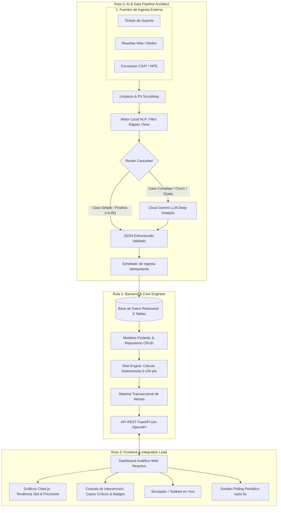

# 🌐 Plan Maestro de Implementación General
**Proyecto 6 — Monitor de Sentimiento de Clientes y Alertas de Riesgo de Abandono (Churn)**

*Documento de arquitectura integral y coordinación técnica del Sprint de 3 días para el equipo de desarrollo.*

---

## 🎯 1. Visión General del Proyecto

### 1.1 El Problema de Negocio
Las empresas reciben volúmenes masivos de feedback no estructurado (tickets de soporte, reseñas públicas, encuestas NPS/CSAT y chats). Los métodos tradicionales basados en palabras clave fallan ante el sarcasmo, las quejas sutiles y la falta de categorización de causa raíz, impidiendo intervenir a tiempo antes de que los clientes de alto valor abandonen el servicio (*Churn*).

### 1.2 La Solución de Ingeniería
Un sistema analítico automatizado de alta resiliencia compuesto por:
1. **Pipeline de Ingesta & IA (Local-First):** Sanitización PII, inferencia en cascada (Local NLP ultrarrápido + Cloud LLM para casos complejos) y extracción estructurada de señales semánticas.
2. **Core Backend & Risk Engine:** Base de datos relacional (6 tablas normalizadas), motor de riesgo determinista (0–100 pts), gestión transaccional de alertas y API RESTful.
3. **Dashboard Analítico en Tiempo Real:** Visualización interactiva con Chart.js, KPIs de salud, tabla de casos críticos y simulador de feedback en vivo.

---

## 👥 2. Las 3 Rutas de Trabajo del Equipo



---

### 🛠️ RUTA 1: Backend & Core Engineer
* **Documento Detallado:** [`docs/PLAN_IMPLEMENTACION_BACKEND_CORE.md`](file:///c:/Users/SEBAS/Desktop/Antigravit/HU_seman4_IA/docs/PLAN_IMPLEMENTACION_BACKEND_CORE.md)
* **Entregables Clave:**
  1. **Esquema Relacional de 6 Tablas:** `customers`, `interactions`, `sentiment_analysis`, `friction_points`, `churn_risk`, `alerts`.
  2. **Risk Engine Determinista (0–100 pts):** Sentimiento negativo ($+20$), Frustración ($+20$), Intención explícita de cancelar ($+30$), Recurrencia ($+15$), Soporte/SLA ($+10$), Señal reciente ($+5$).
  3. **Sistema de Alertas Transaccional:** Disparo en niveles `Alto` (60–79) y `Crítico` (80–100) con estados (`PENDING`, `IN_REVIEW`, `RESOLVED`) y prevención de duplicados/cooldown.
  4. **API FastAPI:** Endpoints documentados en OpenAPI para ingesta, analítica, gestión de alertas y health check.

---

### 🧠 RUTA 2: AI & Data Pipeline Architect
* **Documento Detallado:** [`docs/PLAN_IMPLEMENTACION_AI_DATA_PIPELINE.md`](file:///c:/Users/SEBAS/Desktop/Antigravit/HU_seman4_IA/docs/PLAN_IMPLEMENTACION_AI_DATA_PIPELINE.md)
* **Entregables Clave:**
  1. **Sanitización & PII Scrubbing:** Enmascaramiento de datos personales (emails, teléfonos, nombres) para cumplimiento de privacidad y ahorro de tokens.
  2. **Inferencia en Cascada (Local-First):** 
     - *Paso 1:* Motor Local NLP en Python puro ($<5$ ms, 0 costo) resuelve casos simples y claros.
     - *Paso 2:* Si el caso es complejo, ambiguo, negativo o con intención de churn, escala a Cloud LLM (Gemini) para análisis semántico profundo.
     - *Paso 3:* Si la nube falla o no hay API Key, el motor local actúa como fallback instantáneo garantizando 100% de disponibilidad.
  3. **Contrato JSON Estructurado:** Entrega estricta de `{ sentiment, emotion, friction_points, churn_intent, confidence, evidence }`.
  4. **Worker de Ingesta con Scheduler:** Automatización periódica con APScheduler, control de idempotencia y reintentos.

---

### 🎨 RUTA 3: Frontend & Integration Lead
* **Documento Detallado:** [`docs/PLAN_IMPLEMENTACION_FRONTEND_INTEGRATION.md`](file:///c:/Users/SEBAS/Desktop/Antigravit/HU_seman4_IA/docs/PLAN_IMPLEMENTACION_FRONTEND_INTEGRATION.md)
* **Entregables Clave:**
  1. **Tablero Analítico Reactivo:** KPIs superiores (Total procesados, % Sentimiento neto, NPS predictivo, Casos críticos).
  2. **Visualizaciones Chart.js:** Gráfico de evolución temporal de sentimiento a 30 días y gráfico de barras de puntos de fricción.
  3. **Matriz de Intervención:** Tabla dinámica de clientes en riesgo con badges de severidad, evidencia textual y modal de resolución rápida.
  4. **Testbed / Simulador en Vivo:** Consola para inyectar feedback en vivo y visualizar la respuesta inmediata de la IA y el Risk Engine.
  5. **Sincronización:** Sondeo periódico inteligente (*polling* cada 5s) con manejo de estados de carga y error.

---

## 🏛️ 3. Principio Arquitectónico Rector

> [!IMPORTANT]
> **Separación de Responsabilidades:** La IA interpreta lenguaje y extrae señales semánticas estructuradas; el Backend valida y aplica las reglas de negocio deterministas. Los cálculos matemáticos de riesgo, los umbrales de alerta, la persistencia y la deduplicación no dependen jamás de texto libre generado por el LLM.

---

## 📚 4. Estructura de Entregables del Proyecto

```text
HU_seman4_IA/
├── docs/
│   ├── PLAN_IMPLEMENTACION_GENERAL.md               # Plan Maestro General
│   ├── PLAN_IMPLEMENTACION_BACKEND_CORE.md          # Especificación para Backend
│   ├── PLAN_IMPLEMENTACION_AI_DATA_PIPELINE.md      # Especificación para AI Architect
│   ├── PLAN_IMPLEMENTACION_FRONTEND_INTEGRATION.md  # Especificación para Frontend Lead
│   ├── 01_DIAGRAMA_ARQUITECTURA_SOLUCION.md         # Entregable Gerencial 1
│   ├── 02_MATRIZ_RIESGOS_Y_MITIGACION.md            # Entregable Gerencial 2
│   ├── 03_DEFINICION_DE_HECHO_Y_CRITERIOS_ACEPTACION.md # Entregable Gerencial 3
│   ├── 04_ANALISIS_EFICIENCIA_Y_ELECCION_TECNOLOGICA.md # Entregable Gerencial 4
│   └── 05_INFORME_VALIDACION_Y_METRICAS_IMPACTO.md  # Entregable Gerencial 5
├── ai_pipeline/                                     # Módulos del AI Architect
├── backend/                                         # Módulos del Backend Engineer
├── static/                                          # Interfaz Web del Frontend Lead
└── tests/                                           # Suite completa de pruebas
```

---

## 🧪 5. Plan de Verificación y Validación Integral

### 5.1 Suite de 12 Casos de Prueba
1. Mensaje positivo directo.
2. Frustración y queja de soporte.
3. Intención explícita de cancelación.
4. Mensaje ambiguo / Sarcasmo e ironía.
5. Mensaje vacío o con ruido.
6. Interacción duplicada (prueba de idempotencia).
7. Mensaje con datos sensibles (prueba de PII scrubbing).
8. Caída de conexión Cloud LLM (activación automática de Fallback local).
9. Respuesta JSON malformada (corrección y validación Pydantic).
10. Múltiples mensajes de un mismo cliente (prueba de recurrencia en Risk Engine).
11. Historial extenso (+2000 palabras).
12. Recuperación de transacciones tras fallo (`ERROR_RETRY`).

### 5.2 Criterios de Aceptación Operacionales
- Cobertura de pruebas unitarias y de integración $\ge 90\%$.
- Latencia promedio de inferencia local $< 5$ ms.
- Latencia promedio de inferencia Cloud $< 2.5$ s.
- 0 caídas del sistema ante desconexión de internet o falta de API Key.