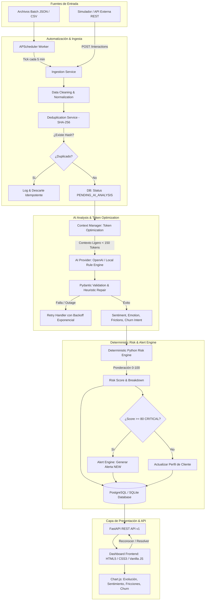

# Diagrama de Arquitectura y Flujo Técnico

## 1. Visión General de la Arquitectura

El sistema **ChurnGuard AI** implementa una arquitectura multicapa desacoplada y reactiva orientada a la detección temprana del riesgo de abandono de clientes (*churn*) mediante Inteligencia Artificial y un motor de cálculo determinístico en Python.

---

## 2. Descripción Detallada de Componentes

### A. Capa de Ingesta & Deduplicación
- **`IngestionPipelineService`**: Coordina el pipeline de 10 etapas garantizando atomicidad transaccional.
- **`DeduplicationService`**: Normaliza el texto (eliminando redundancias de espacios y mayúsculas) y computa un hash SHA-256 único: $\text{SHA256}(\text{CustomerExternalId} + \text{NormalizedContent})$. Impide procesar duplicados sin generar excepciones no controladas.

### B. Capa de Inteligencia Artificial & Optimización de Contexto
- **`ContextManagerService`**: Mantiene un resumen histórico compacto de 1-2 oraciones por cliente en lugar de enviar el historial completo de chats/tickets, reduciendo el consumo de tokens entre un **80% y 90%**.
- **`AIAnalysisOutput`**: Esquema Pydantic que valida estrictamente la respuesta del LLM (sentimiento, emoción dominante, categorías normalizadas de fricción, intención de churn booleana y evidencia textual).
- **Dual AI Provider**:
  - `OpenAILLMProvider`: Conexión con modelos en la nube (OpenAI GPT-4o-mini / Gemini) con reparación automática de JSON.
  - `DeterministicRuleAIProvider`: Motor de reglas semánticas determinístico para ejecución offline, testing y demostraciones sin costo.

### C. Motor Determinístico de Riesgo (Risk Engine)
- **`RiskEngine`**: Calcula el *Risk Score* de 0 a 100 mediante fórmulas matemáticas determinísticas ejecutadas exclusivamente en Python, evitando alucinaciones del LLM en cálculos cuantitativos.
- Ponderaciones configurables:
  - Sentimiento Negativo: $+20$ | Positivo: $-10$
  - Frustración: $+20$ | Enojo: $+25$ | Decepción: $+15$
  - Intención explícita de cancelar: $+30$
  - Fricción con Soporte: $+10$
  - Fricción Recurrente en historial: $+15$
  - Señal negativa acumulada en últimos 7 días: $+5$
  - Multiplicador Enterprise: $1.1\times$

### D. Motor de Alertas (Alert Engine)
- **`AlertService`**: Detecta automáticamente cuando el riesgo alcanza nivel **CRITICAL** ($\ge 80$) y crea una alerta con estado `NEW`.
- Ciclo de vida: `NEW` $\rightarrow$ `ACKNOWLEDGED` $\rightarrow$ `RESOLVED`.

### E. Capa de Exposición (FastAPI & Dashboard)
- **FastAPI REST API**: Endpoints con paginación, filtros, documentación Swagger automática en `/docs` y soporte CORS.
- **Frontend Dashboard**: HTML5 semántico, CSS3 moderno con tema oscuro SaaS, JavaScript Vanilla puro y gráficos interactivos con Chart.js.
