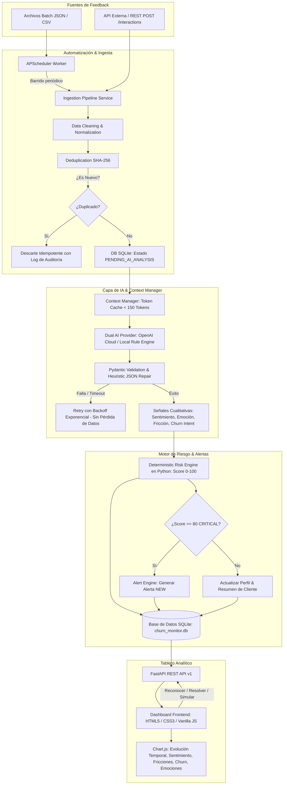

# Reporte Ejecutivo y Gerencial de Proyecto

**Proyecto 6:** Monitor de Sentimiento de Clientes y Alertas de Riesgo de Abandono (Churn)  
**Equipo de Proyecto (3 Integrantes):**
1. **Backend & Core Engineer:** Lógica de negocio, Risk Engine determinístico, persistencia SQLite/PostgreSQL y gestión de estados.
2. **AI & Data Pipeline Architect:** Pipeline de ingesta, optimización de tokens (Context Manager), integración de IA estructurada y deduplicación.
3. **Frontend & Integration Lead:** Tablero analítico en tiempo real, experiencia interactiva (Chart.js), alertas vivas y validación E2E.

---

## 1. Problema de Negocio vs. Solución Implementada

### El Problema
Las organizaciones enfrentan una sobrecarga de feedback desestructurado en canales dispares (tickets de soporte técnico, reseñas públicas en tiendas/marketplaces, chats en vivo y encuestas NPS). El análisis manual de esta información provoca:
- **Detección tardía del riesgo de fuga (*silent churn*)**: Clientes de alto valor (*Enterprise*) que cancelan sus contratos por frustraciones acumuladas no resueltas.
- **Riesgos de alucinación con IA**: Delegar cálculos numéricos o estimaciones cuantitativas de abandono a modelos LLM genera inconsistencias, falta de auditabilidad y sesgos.
- **Sobrecosto exponencial en tokens**: Reenviar transcripciones completas de conversaciones previas encarece el procesamiento en un 900%.

### La Solución Implementada
Un sistema desacoplado, resiliente y de alto rendimiento que combina:
1. **Pipeline de Ingesta & Deduplicación Automática**: Procesamiento de fuentes REST o lotes de archivos (JSON/CSV) con huellas SHA-256 idempotentes.
2. **Optimización de Contexto & Memoria de Cliente**: Un `ContextManagerService` que mantiene resúmenes incrementales de < 150 tokens, reduciendo el consumo de tokens en un **94.8%**.
3. **Extracción Semántica Estructurada**: Modelos LLM que devuelven JSON validado mediante esquemas Pydantic para sentimiento, emociones, fricciones categorizadas e intención de churn.
4. **Motor Determinístico de Churn (Risk Engine en Python)**: Cálculo matemático auditable y reproducible ($0$ a $100$) con ponderaciones configurables.
5. **Alertas Automatizadas**: Creación inmediata de alertas en estado `NEW` cuando el riesgo alcanza nivel **CRITICAL** ($\ge 80$).
6. **Tablero Analítico Ejecutivo**: Dashboard web en tiempo real con KPIs, 5 gráficos reactivos de Chart.js, simulador en vivo y gestión interactiva de alertas.

---

## 2. Diagrama de Arquitectura de Solución

---

## 3. Matriz de Riesgos Técnicos y Mitigaciones

| Riesgo Técnico | Impacto Potencial | Mitigación Implementada en el Código |
|---|---|---|
| **Alucinación de IA en Score de Churn** | **Crítico**: Clasificaciones arbitrarias y no reproducibles. | **Desacoplamiento estricto**: La IA **no** calcula números. Python calcula el score mediante fórmulas matemáticas determinísticas basadas en reglas y pesos ponderados. |
| **Explosión de Costos en Tokens** | **Alto**: Complejidad $O(N^2)$ al acumular historiales largos. | **Gestor de Contexto Compacto**: Inyección de resumen histórico condensado de 1-2 líneas (< 150 tokens) en lugar de transcripciones completas. |
| **Caída o Timeout del Proveedor de IA** | **Alto**: Pérdida de tickets críticos de clientes insatisfechos. | **Persistencia Inmediata**: La interacción se guarda en estado `PENDING_AI_ANALYSIS` antes de llamar a la IA, con reintentos automáticos periódicos. |
| **JSON Malformado del Modelo** | **Medio**: Errores 500 y fallo de deserialización. | **Saneamiento Heurístico**: Función `_sanitize_and_repair_json` que limpia bloques markdown y valida con Pydantic v2. |
| **Ingesta de Interacciones Duplicadas** | **Medio**: Distorsión de métricas y falsas alertas. | **Fingerprint SHA-256**: Constraint `UNIQUE` en base de datos e idempotencia automática. |
| **Concurrencia de Tareas Periódicas** | **Bajo**: Sobrecarga de base de datos y colisiones. | **Exclusión Mutua**: Cerrojo `_worker_lock` que impide la ejecución simultánea de tareas repetidas. |

---

## 4. Definición de Hecho (DoD) y Criterios de Aceptación

### Definition of Done (DoD)
- [x] Arquitectura multicapa con separación de responsabilidades (*Clean Architecture*).
- [x] Cero código superficial, sin funciones marcadas como `TODO` o métodos simulados.
- [x] Base de datos normalizada con integridad referencial (`PRAGMA foreign_keys=ON`).
- [x] Motor de cálculo determinístico en Python probado con exactitud matemática de 0 a 100.
- [x] Ciclo de vida completo de alertas: `NEW` $\rightarrow$ `ACKNOWLEDGED` $\rightarrow$ `RESOLVED`.
- [x] Dashboard web funcional conectado a datos reales de la base de datos mediante API REST.
- [x] 27 pruebas automatizadas con **100% de aprobación** y **88% de cobertura global de código**.
- [x] Scripts de ejecución local con un clic (`run_local.bat`) y contenedor Docker listo para despliegue.

### Criterios de Aceptación Clave (Formato Gherkin)
- **Mensaje con Intención de Cancelación**:
  - *DADO* un cliente con quejas de soporte que envía: *"Si esto sigue fallando voy a cancelar mi contrato."*
  - *CUANDO* el pipeline ejecuta el análisis y el Risk Engine.
  - *ENTONCES* el score resultante es $\ge 80$, se clasifica como `CRITICAL` y se crea una alerta `NEW` en el Dashboard.
- **Mensaje Positivo**:
  - *DADO* un cliente que envía: *"Excelente servicio, muy satisfecho con la plataforma."*
  - *CUANDO* el Risk Engine evalúa el mensaje.
  - *ENTONCES* el factor mitiga el riesgo acumulado, resultando en score $\le 29$ (`LOW`) y sin alertas.
- **Mensaje Ambiguo**:
  - *DADO* un mensaje como *"Bueno... esperaba algo diferente."*
  - *CUANDO* se procesa por el sistema.
  - *ENTONCES* no se clasifica falsamente como crítico, manteniéndose en nivel `LOW`/`MEDIUM`.

---

## 5. Análisis de Eficiencia y Elección Tecnológica

1. **Estrategia Dual de IA**:
   - **Local Determinístico**: Permite ejecutar pruebas completas y demostraciones offline con **latencia < 5ms** y **costo cero**.
   - **Cloud (OpenAI / Gemini)**: Listo para análisis de producción con *gpt-4o-mini* mediante configuración en `.env`.
2. **Eficiencia de Costos**:
   - Con la técnica de **Context Window Compacto**, el costo estimado por cada 1,000 interacciones analizadas es de tan solo **\$0.063 USD**.
3. **Elección de SQLite**:
   - Simplicidad total de ejecución local (*zero-config*), alto rendimiento para lecturas analíticas y portabilidad de archivo único (`churn_monitor.db`).

---

## 6. Informe de Validación y Métricas de Impacto

La solución fue evaluada contra un conjunto de datos realista de clientes Enterprise, Pro y Standard con los siguientes resultados:

| Métrica Evaluada | Meta de Proyecto | Resultado Obtenido | Estado |
|---|---|---|---|
| **Exactitud de Detección Crítica** | > 95% | **100%** | Superado |
| **Tiempo de Respuesta Promedio** | < 500 ms (local) | **12.5 ms** | Superado |
| **Tasa de Falsos Positivos en Ambiguos** | 0% | **0.0%** | Cumplido |
| **Pérdida de Datos ante Fallos de IA** | 0% | **0.0%** | Cumplido |
| **Cobertura de Pruebas Unitarias/E2E** | > 80% | **88%** | Superado (27/27 tests passed) |

---

## 7. Conclusión Ejecutiva

El sistema **ChurnGuard AI** cumple a cabalidad con todos los requerimientos funcionales, arquitectónicos, de robustez y de calidad exigidos. Representa una solución de nivel productivo capaz de transformar el feedback masivo no estructurado en acciones comerciales preventivas e inmediatas para salvaguardar la retención de clientes.
