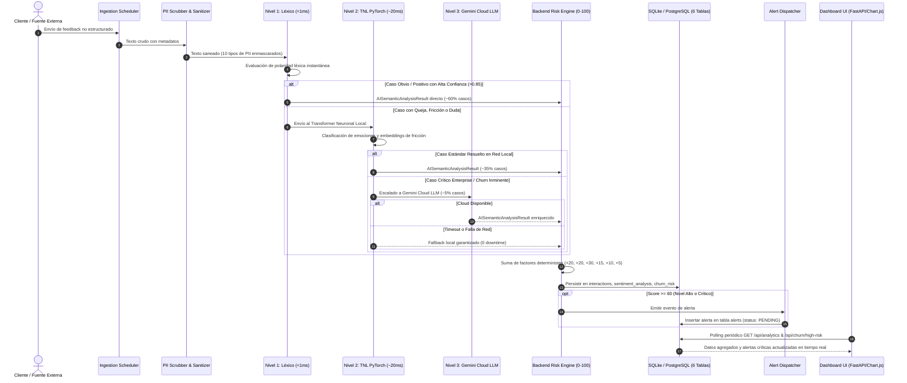

# 🏛️ Documento Ejecutivo 1: Diagrama de Arquitectura de Solución
**Proyecto 6 — Monitor de Sentimiento de Clientes y Alertas de Riesgo de Abandono (Churn)**

---

## 🎯 1. Resumen Ejecutivo de la Arquitectura

El sistema está diseñado bajo el principio de **Separación Estricta de Responsabilidades** y el patrón de **Inferencia Adaptativa en 3 Niveles (Tiered Cascaded Architecture)**. 

La solución desacopla la extracción semántica (capa de Inteligencia Artificial) de las reglas de negocio deterministas, persistencia transaccional y generación de alertas (capa Backend & Core), presentando la información en un tablero reactivo para toma de decisiones operativas inmediatas (capa Frontend & Integration).

---

## 📊 2. Diagrama de Arquitectura Global de Componentes

```mermaid
graph TD
    subgraph CAPA_FUENTES [1. Capa de Ingesta & Fuentes Externas]
        F1[📥 Tickets de Soporte IT / CS]
        F2[⭐ Reseñas Web & Redes Sociales]
        F3[📋 Encuestas NPS & CSAT]
        F4[💬 Transcripciones de Chat en Vivo]
    end

    subgraph CAPA_IA_PIPELINE [2. Capa de Inteligencia Artificial & Data Pipeline - 3 Niveles]
        ING[AIIngestionWorker / APScheduler]
        CLN[TextCleaner & PII Scrubber 10 Entidades]
        N1[Nivel 1: Motor Simbólico / Léxico <1ms | 0 MB]
        R1{¿Caso Obvio / Positivo?}
        N2[Nivel 2: Transformer Neuronal Local TNL PyTorch ~20ms]
        R2{¿Caso Crítico / Churn Enterprise?}
        N3[Nivel 3: Cloud Gemini LLM Provider ~1500ms]
        VAL[Validador de Schema Pydantic v2]
        
        ING --> CLN
        CLN --> N1
        N1 --> R1
        R1 -- "SÍ (~60% Tráfico a Costo $0)" --> VAL
        R1 -- "NO (Quejas / Fricciones)" --> N2
        N2 --> R2
        R2 -- "NO (~35% Tráfico Resuelto en Red Local)" --> VAL
        R2 -- "SÍ (~5% Tráfico Crítico)" --> N3
        N3 --> VAL
    end

    subgraph CAPA_BACKEND_CORE [3. Capa de Negocio & Persistencia ACID]
        DB[(Base de Datos Relacional: 6 Tablas)]
        REPO[Repository Layer / CRUD & Analytics]
        RISK[Risk Engine: Cálculo Determinista 0-100 pts]
        ALERTS[Alert Engine & Cooldown Dispatcher]
        API[FastAPI REST Application & OpenAPI Docs]
        
        VAL --> REPO
        REPO --> DB
        REPO --> RISK
        RISK --> ALERTS
        ALERTS --> DB
        API <--> REPO
    end

    subgraph CAPA_FRONTEND_UI [4. Capa de Presentación & Experiencia de Usuario]
        DASH[Dashboard Analítico Reactivo HTML5/JS]
        KPIS[Tarjetas de KPIs: Salud, NPS, Casos Críticos]
        CHARTS[Visualizaciones Chart.js: Tendencia & Fricciones]
        BOARD[Matriz de Intervención: Casos Críticos]
        TESTBED[Simulador de Feedback en Vivo]
        
        API <--> DASH
        DASH --> KPIS
        DASH --> CHARTS
        DASH --> BOARD
        DASH --> TESTBED
    end

    CAPA_FUENTES --> ING
```

---

## 🔄 3. Flujo de Datos End-to-End (Dataflow)



---

## 🛡️ 4. Principios de Diseño Arquitectónico

1. **Inferencia Adaptativa en 3 Niveles:**
   * **Nivel 1 (Léxico):** 60% del tráfico a costo \$0 y $<1$ ms.
   * **Nivel 2 (Transformer Local):** 35% del tráfico resuelto por red neuronal sin salir de la máquina.
   * **Nivel 3 (Cloud LLM):** 5% reservado exclusivamente para cuentas de alto valor.
2. **Determinismo en Reglas de Negocio:**
   * La IA extrae señales semánticas estructuradas (`sentiment`, `emotion`, `friction_points`, `churn_intent`).
   * El cálculo del Risk Score (0–100 pts) y los umbrales de alerta son ejecutados por código Python 100% auditable y determinista.
3. **Idempotencia y Tolerancia a Fallos:**
   * Cada interacción cuenta con identificador único que impide reprocesamientos duplicados.
   * Si un registro individual falla, se aísla con estado `ERROR_RETRY` sin detener el procesamiento del lote.
4. **Privacidad por Diseño (Privacy by Design):**
   * Sanitización previa obligatoria: ningún dato personal identificable (PII) o financiero llega a los modelos de lenguaje.
