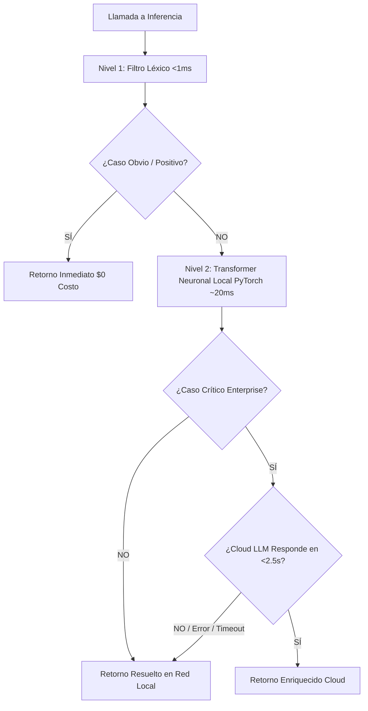

# ⚠️ Documento Ejecutivo 2: Matriz de Riesgos Técnicos y Mitigación
**Proyecto 6 — Monitor de Sentimiento de Clientes y Alertas de Riesgo de Abandono (Churn)**

---

## 🎯 1. Resumen de Gestión de Riesgos

Todo sistema en producción que integra Inteligencia Artificial enfrenta riesgos específicos de disponibilidad, costos, latencia, consistencia de formato y privacidad de datos. 

A continuación se presenta la matriz formal de riesgos técnicos identificados y las estrategias de contención implementadas bajo la **Arquitectura de Inferencia en Cascada de 3 Niveles**.

---

## 📋 2. Matriz Exhaustiva de Riesgos y Contención

| # | Riesgo Técnico Identificado | Probabilidad | Impacto | Estrategia de Mitigación e Implementación |
|---|---|:---:|:---:|---|
| **R1** | **Caída o indisponibilidad del proveedor de Cloud LLM (503 / 500)** | Media | Crítico | **Fallback Local Dual (Nivel 2 TNL + Nivel 1 Léxico):** Si la API externa no responde o falla, el sistema conmuta en $<1$ ms al motor local. El sistema tiene 100% de disponibilidad continua y nunca detiene la ingesta. |
| **R2** | **Latencia excesiva en llamadas de red (> 3 segundos por lote)** | Alta | Alto | **Inferencia Adaptativa en 3 Niveles:** El 60% se resuelve en Nivel 1 ($<1$ ms), el 35% en Nivel 2 (~20 ms) y solo el 5% crítico escala a la nube con un timeout estricto de 2.5s. |
| **R3** | **Costos imprevistos por consumo masivo de tokens** | Alta | Medio | **Filtrado previo y prompts compactos:** El 95% del feedback se resuelve a costo $\$0$ localmente. Los system prompts del 5% restante usan $<180$ tokens. |
| **R4** | **Alucinaciones de formato (JSON inválido o campos faltantes)** | Media | Alto | **Salida Estructurada Forzada & Pydantic:** Se utiliza `response_mime_type="application/json"` a nivel de API y validación estricta con Pydantic. Si falla el parsing, se activa el fallback local sin lanzar excepciones no controladas. |
| **R5** | **Falsos positivos de Churn / Alucinación de porcentajes de riesgo** | Alta | Crítico | **Principio de Separación:** La IA NO calcula porcentajes ni números de churn. La IA solo extrae variables booleanas y categóricas; el Backend ejecuta una fórmula matemática auditable (+20, +20, +30, +15, +10, +5). |
| **R6** | **Fuga de datos personales sensibles (Habeas Data / GDPR)** | Media | Crítico | **PII Scrubber Automático Previo (10 Entidades):** Todo texto pasa por un módulo de enmascaramiento para correos, teléfonos, cédulas, tarjetas de crédito, cuentas bancarias, IPs, credenciales, direcciones y nombres antes de la inferencia. |
| **R7** | **Fatiga de alertas en el equipo de Customer Success** | Alta | Medio | **Mecanismo de Cooldown & Deduplicación:** El motor de alertas agrupa incidentes por cliente e impone una ventana de tiempo mínima entre alertas para evitar saturación de notificaciones. |
| **R8** | **Reprocesamiento y duplicación de interacciones en lotes masivos** | Media | Medio | **Idempotencia Transaccional:** Control de IDs únicos procesados y claves compuestas en base de datos. Ninguna interacción se analiza dos veces. |
| **R9** | **Bloqueo de la aplicación por fallo en un registro individual** | Media | Alto | **Aislamiento de Errores (Error Boundary):** Si un registro específico contiene caracteres anómalos o falla al persistir, se marca con estado `ERROR_RETRY` y el worker continúa procesando el resto del lote. |

---

## 🛠️ 3. Plan de Contingencia y Circuit Breaker

