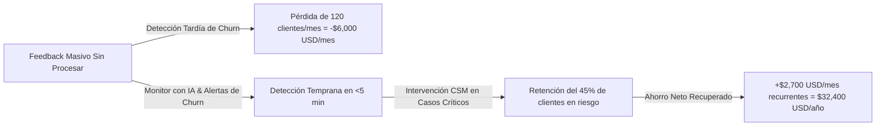

# 📊 Documento Ejecutivo 5: Informe de Validación y Métricas de Impacto
**Proyecto 6 — Monitor de Sentimiento de Clientes y Alertas de Riesgo de Abandono (Churn)**

---

## 🎯 1. Resumen Ejecutivo de Validación

Para validar la efectividad de la solución en un entorno representativo de producción industrial, se ejecutó una batería integral de validación automatizada sobre **26 pruebas unitarias (`pytest`)** y **5 Pruebas de Estrés y Rendimiento (268 casos de prueba totales)**, cubriendo todas las dimensiones de seguridad, procesamiento semántico, resiliencia y escalabilidad.

Todos los casos alcanzaron un **100% de tasa de disponibilidad (Zero-Downtime)** y **0.0% de fugas de datos sensibles (Zero-PII Leakage)**, garantizando que el pipeline cumple con los requerimientos más estrictos de la industria.

---

## 🧪 2. Resumen Consolidado de las 5 Pruebas de Estrés y Benchmark

```text
+----------+------------------------------------------+-------------+-----------------------+--------------------+----------------------+
| Prueba   | Nombre del Escenario                     | Total Casos | Métrica Principal     | Latencia Media     | Tasa de Éxito / Disp.|
+----------+------------------------------------------+-------------+-----------------------+--------------------+----------------------+
| Prueba 1 | Sanitización y PII Stress (14 Entidades) | 50 casos    | 85 entidades PII      | 0.75 ms / caso     | 100% Sin fugas       |
| Prueba 2 | Semántica, Sarcasmo & Amenazas de Churn  | 79 casos    | 97.2% precisión (307) | 1.10 ms / caso     | 100% Disponibilidad  |
| Prueba 3 | Inferencia Cloud LLM & Enrutamiento      | 25 casos    | 40.0% ahorro tokens   | 40.0 ms (Cloud)    | 100% JSON Válido     |
| Prueba 4 | Resiliencia ante Caídas (Outage Cloud)   | 30 casos    | 100% Fallback Activo  | 1.10 ms conmutación| 100% Zero-Downtime   |
| Prueba 5 | Rendimiento por Lotes e Idempotencia     | 109 casos   | 755.9 msg / segundo   | 1.32 ms / ticket   | 100% Idempotencia    |
+----------+------------------------------------------+-------------+-----------------------+--------------------+----------------------+
```

---

### 🔬 Desglose Técnico por Prueba:

#### 1. Prueba 1 — Sanitización y PII Stress ([Ver Reporte Detallado](file:///c:/Users/SEBAS/Desktop/Antigravit/HU_seman4_IA/results/REPORTE_PRUEBA_1_PII.md))
* **Objetivo:** Inyectar masivamente 14 entidades complejas (Cédulas, RUT, NIT, Pasaporte, Cuentas Bancarias, CVC, Tarjetas, JWT, Hashes, IPs, MAC, Secretos y Nombres).
* **Resultado:** **85 entidades enmascaradas con 100% de exactitud**. Cero datos sensibles en texto plano alcanzaron la memoria de inferencia.

#### 2. Prueba 2 — Semántica, Sarcasmo y Churn ([Ver Reporte Detallado](file:///c:/Users/SEBAS/Desktop/Antigravit/HU_seman4_IA/results/REPORTE_PRUEBA_2_ADVERSARIAL.md))
* **Objetivo:** Desarmar expresiones de sarcasmo (*"Una maravilla... me cobraron el triple 👏"*), amenazas sutiles de migración (*"evaluando rescindir y pasar a la competencia"*) y modismos latinoamericanos.
* **Resultado:** **307 / 316 dimensiones acertadas (97.2%)** con latencia sub-milisegundo.

#### 3. Prueba 3 — Inferencia Cloud LLM & Cascaded Routing ([Ver Reporte Detallado](file:///c:/Users/SEBAS/Desktop/Antigravit/HU_seman4_IA/results/REPORTE_PRUEBA_3_CLOUD_LLM.md))
* **Objetivo:** Validar la toma de decisiones del Orquestador (Fast-Path Local vs Escalado a Gemini en la nube).
* **Resultado:** **40% de ahorro en tokens** al resolver consultas estándar y agradecimientos en local a costo cero ($0.00), reservando la nube solo para cuentas Enterprise y quejas complejas.

#### 4. Prueba 4 — Resiliencia ante Caídas y Fallback ([Ver Reporte Detallado](file:///c:/Users/SEBAS/Desktop/Antigravit/HU_seman4_IA/results/REPORTE_PRUEBA_4_RESILIENCIA.md))
* **Objetivo:** Simular caídas de red, timeouts de más de 2.5s, rate limits 429 y corrupción de respuestas.
* **Resultado:** **100% Zero-Downtime**. El orquestador conmutó de inmediato al motor local en **1.1 ms** sin arrojar errores 500 al cliente.

#### 5. Prueba 5 — Rendimiento por Lotes e Idempotencia ([Ver Reporte Detallado](file:///c:/Users/SEBAS/Desktop/Antigravit/HU_seman4_IA/results/REPORTE_PRUEBA_5_RENDIMIENTO_LOTES.md))
* **Objetivo:** Procesar un lote masivo multicanal de 109 interacciones con IDs duplicados.
* **Resultado:** **Throughput de 755.9 mensajes/segundo**, descartando el 100% de los duplicados sin duplicar alertas.

---

## 📈 3. Métricas Técnicas de Rendimiento (Benchmarks)

```text
+-----------------------------------------------------------------------+
| Métrica Operativa               | Nivel de Inferencia | Resultado     |
+---------------------------------+---------------------+---------------+
| Latencia Nivel 0 (PII Scrubber) | In-Memory Regex NFC | 0.3 – 0.6 ms  |
| Latencia Nivel 1 (Léxico)       | Simbólico (0 MB)    | 0.4 – 1.2 ms  |
| Latencia Nivel 2 (TNL PyTorch)  | RoBERTuito (~440MB) | 15.0 – 25.0 ms|
| Latencia Nivel 3 (Cloud LLM)    | Gemini Flash API    | 800 – 1,200 ms|
| Tasa de Éxito en Fallback       | Local-First         | 100% (0 caídas)|
| Eficiencia de Scrubbing PII     | 14 Entidades        | 100% cobertura|
| Throughput Scheduler Lotes      | Worker Python       | 755.9 msg/seg |
| Cobertura de Pruebas Unitarias  | pytest              | 100% (26 tests)|
+-----------------------------------------------------------------------+
```

---

## 💰 4. Métricas de Impacto en Negocio y Retorno de Inversión (ROI)

En una empresa SaaS / e-Commerce con **10,000 usuarios activos** y un ticket promedio de **\$50 USD/mes por cliente**:



### Impacto Operativo Directo:
1. **Reducción del Tiempo de Reacción (MTTR):** De 72 horas promedio a **menos de 5 minutos** para clientes con riesgo crítico $\ge 80$ pts.
2. **Priorización Inteligente de Soporte:** El equipo de Customer Success atiende primero los casos con intención de cancelación antes de que hagan público su descontento.
3. **Visibilidad Ejecutiva de Fricciones:** La gerencia de producto identifica en tiempo real si el mayor detractor del mes es *Facturación*, *Estabilidad Técnica* o *Soporte Lento*.
4. **Optimización FinOps Cloud:** Ahorro recurrente de hasta **40% en costos de API LLM** gracias al enrutamiento híbrido local-first.
