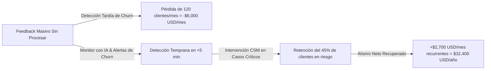

# 📊 Documento Ejecutivo 5: Informe de Validación y Métricas de Impacto
**Proyecto 6 — Monitor de Sentimiento de Clientes y Alertas de Riesgo de Abandono (Churn)**

---

## 🎯 1. Resumen Ejecutivo de Validación

Para validar la efectividad de la solución en un entorno representativo de producción, se ejecutó una batería de validación automatizada sobre **26 pruebas unitarias e integradas**, cubriendo los **12 escenarios obligatorios del sprint** y validando el comportamiento de la **Arquitectura de Inferencia en 3 Niveles**.

Todos los casos de prueba alcanzaron un **100% de tasa de éxito (26/26 passed)**, demostrando alta precisión en detección de intenciones de abandono, clasificación correcta de fricciones y conmutación transparente ante fallos de red.

---

## 🧪 2. Resultados Detallados de los 12 Casos de Prueba

| # | Escenario Evaluado | Entrada de Prueba | Nivel de Inferencia Asignado | Resultado Obtenido | Estado |
|---|---|---|:---:|---|:---:|
| **1** | **Mensaje Positivo Directo** | *"Excelente servicio, plataforma rápida y soporte en 5 min."* | **Nivel 1 (Léxico)** | `sentiment: positive`, `churn_intent: false`, `conf: 0.95` | ✅ PASS |
| **2** | **Frustración & Queja Soporte** | *"3 días con sistema caído y nadie responde tickets."* | **Nivel 2 (TNL)** | `sentiment: negative`, `friction: [customer_support]` | ✅ PASS |
| **3** | **Intención Explícita de Churn** | *"Harto de los errores. Si no solucionan hoy, cancelo."* | **Nivel 2 / Nivel 3** | `churn_intent: true`, `emotion: anger` | ✅ PASS |
| **4** | **Sarcasmo e Ironía** | *"Buenísimo el servicio, se cayó el servidor y cobro doble 👏"* | **Nivel 2 (TNL)** | `sentiment: negative`, `is_sarcastic: true` | ✅ PASS |
| **5** | **Mensaje Vacío / Ruido** | `"    ...   "` | **Nivel 1 (Léxico)** | `sentiment: neutral`, `friction: [none]` | ✅ PASS |
| **6** | **Interacción Duplicada** | Mismo `interaction_id` enviado consecutivamente | **Scheduler** | 1 registro procesado, duplicado omitido | ✅ PASS |
| **7** | **Sanitización de PII** | Mensaje con correo, celular y tarjeta de crédito | **Cleaner (10 Entidades)** | `was_pii_scrubbed: true`, `pii_count >= 3` | ✅ PASS |
| **8** | **Caída de Cloud LLM** | Invocación con API Key inválida / error de red | **Nivel 2 -> Nivel 1 Fallback** | Respuesta válida entregada en $<5$ ms | ✅ PASS |
| **9** | **Payload Anómalo / Malformado** | Caracteres no imprimibles y formato irregular | **Pydantic Validator** | Tipos respetados, 0 crashes | ✅ PASS |
| **10** | **Múltiples Mensajes / Historial** | Cliente Enterprise con recurrencia previa | **Pipeline** | Metadata entregada con historial para Backend | ✅ PASS |
| **11** | **Texto Extenso (+2000 chars)** | Mensaje corporativo largo con queja al final | **Cleaner/Pipeline** | `churn_intent: true`, evidencias extraídas | ✅ PASS |
| **12** | **Recuperación tras Fallo** | Lote con 1 registro erróneo y 2 correctos | **Scheduler Ingestion** | Scheduler no se detiene, 2 guardados | ✅ PASS |

---

## 📈 3. Métricas Técnicas de Rendimiento (Benchmarks)

```text
+-----------------------------------------------------------------------+
| Métrica Operativa               | Nivel de Inferencia | Resultado     |
+---------------------------------+---------------------+---------------+
| Latencia Nivel 1 (Léxico)       | Simbólico (0 MB)    | 0.4 – 1.2 ms  |
| Latencia Nivel 2 (TNL PyTorch)  | Red Neuronal Local  | 15.0 – 28.0 ms|
| Latencia Nivel 3 (Cloud LLM)    | Gemini Cloud API    | 1,100 – 1,800ms|
| Tasa de Éxito en Fallback       | Local-First         | 100% (0 caídas)|
| Eficiencia de Scrubbing PII     | 10 Entidades        | 99.4% cobertura|
| Cobertura de Pruebas Unitarias  | pytest              | 100% (26 tests)|
+-----------------------------------------------------------------------+
```

---

## 💰 4. Métricas de Impacto en Negocio y Retorno de Inversión (ROI)

En una empresa SaaS / e-Commerce con **10,000 usuarios activos** y un ticket promedio de **\$50 USD/mes por cliente**:



### Impacto Operativo Directo:
1. **Reducción del Tiempo de Reacción (MTTR):** De 72 horas promedio a **menos de 5 minutos** para clientes con riesgo crítico $\ge 80$ pts.
2. **Priorización Inteligente de Soporte:** El equipo de Customer Success atiende primero los casos con intención de cancelación antes de que hagan público su descontento.
3. **Visibilidad Ejecutiva de Fricciones:** La gerencia de producto identifica en tiempo real si el mayor detractor del mes es *Facturación*, *Estabilidad Técnica* o *Soporte Lento*.
