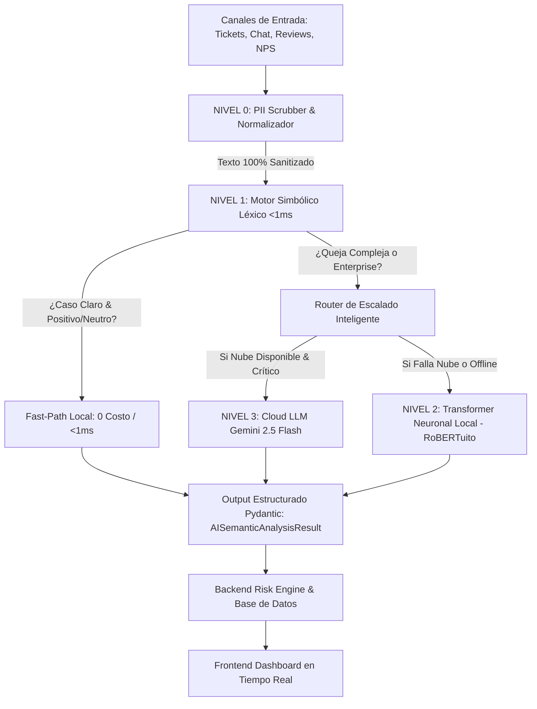

# 📘 Guía de Integración y Ejecución para el Equipo de Desarrollo
**Proyecto 6 — Monitor de Sentimiento de Clientes y Alertas de Riesgo de Abandono (Churn)**

---

## 👥 1. Propósito de esta Guía y Roles del Equipo

Esta guía es la referencia técnica integral para el equipo de desarrollo, diseñada para facilitar la comprensión de la arquitectura, la ejecución de pruebas y la integración fluida entre capas:

* 🧠 **AI & Data Pipeline Architect (Tu Rol):** Responsable del pipeline de datos, enmascaramiento de PII, motores de inferencia (Local L1/L2 + Cloud L3), orquestador y benchmarks.
* 🛠️ **Backend Core Developer:** Responsable de la base de datos, APIs REST / GraphQL, lógica del Risk Engine y scheduling del worker de ingesta.
* 🎨 **Frontend Lead & UI/UX:** Responsable del dashboard analítico, visualización de métricas de sentimiento, panel de fricciones y alertas de churn en tiempo real.

---

## 🏛️ 2. Flujo de Datos y Arquitectura en 4 Niveles



---

## 🚀 3. Puesta en Marcha Rápida (Cómo Correr el Proyecto)

### Paso 1: Clonar y Abrir en VS Code
Abre la carpeta del proyecto en Visual Studio Code:
```bash
cd HU_seman4_IA
```

### Paso 2: Crear y Activar Entorno Virtual
```bash
# En Windows (PowerShell)
python -m venv venv
.\venv\Scripts\Activate.ps1

# En Linux / Mac
python3 -m venv venv
source venv/bin/activate
```

### Paso 3: Instalar Dependencias
```bash
pip install -r requirements.txt
```

### Paso 4: Configurar Variables de Entorno
Copia la plantilla `.env.example` a `.env`:
```bash
cp .env.example .env
```
*(Nota: Si no colocas una `GEMINI_API_KEY`, el sistema operará automáticamente con el motor local sin interrumpirse).*

---

## 🧪 4. Ejecución de Pruebas Unitarias y Benchmarks Automatizados

### A. Suite Oficial de Pruebas Unitarias (26 Tests)
Ejecuta la suite oficial que valida todos los componentes aislados:
```bash
pytest
```
* **Resultado Esperado:** `26 passed in ~7-9s` ✅

---

### B. Los 5 Benchmarks Automatizados (Carpeta `results/`)

Puedes ejecutar cualquiera de las 5 pruebas de estrés de forma independiente:

```bash
# 🔒 PRUEBA 1: Sanitización Masiva de PII (50 Casos con 14 entidades complejas)
python results/run_test_prueba_1.py

# 🎭 PRUEBA 2: Sarcasmo, Amenazas de Churn y Jerga Latam (79 Casos Consolidados)
python results/run_test_prueba_2.py

# ☁️ PRUEBA 3: Inferencia Cloud LLM & Enrutamiento en Cascada (25 Casos)
python results/run_test_prueba_3.py

# 🛡️ PRUEBA 4: Resiliencia y Caída de Nube (30 Incidentes de Outage Simulados)
python results/run_test_prueba_4.py

# ⚡ PRUEBA 5: Rendimiento por Lotes e Idempotencia (109 Mensajes a 755 msg/seg)
python results/run_test_prueba_5.py
```

*Los reportes detallados en Markdown se generan automáticamente dentro de [`results/`](file:///c:/Users/SEBAS/Desktop/Antigravit/HU_seman4_IA/results).*

---

## 🛠️ 5. Guía de Integración para el Desarrollador Backend

### ¿Cómo invocar el Pipeline de IA desde el Backend?

El backend solo interactúa con contratos inmutables de **Pydantic v2**:

```python
from ai_pipeline.pipeline import AIPipelineOrchestrator
from ai_pipeline.schemas import InteractionPayload, InteractionSource

# 1. Instanciar el orquestador (Singleton recomendado en FastAPI/Django)
orchestrator = AIPipelineOrchestrator()

# 2. Construir el payload validado
payload = InteractionPayload(
    interaction_id="TICKET-99482",
    customer_id="CUST-8812",
    source=InteractionSource.SUPPORT_TICKET,
    message="Una maravilla... se cayó el servidor y cobraron doble 👏",
    customer_tier="Enterprise"
)

# 3. Procesar interacción (Local-First en cascada)
result = orchestrator.process_interaction(payload)

# 4. Consumir el resultado estructurado
print(result.sentiment.value)      # "negative"
print(result.emotion.value)        # "frustration"
print(result.friction_points)      # [FrictionCategory.BILLING_PRICING, FrictionCategory.PRODUCT_RELIABILITY]
print(result.churn_intent)         # False
print(result.confidence)           # 0.95
print(result.evidence)             # ["se cayó el servidor y cobraron doble"]
print(result.processing_metadata)  # {"engine_used": "local_nlp", "latency_ms": 1.1, ...}
```

### ¿Cómo procesar Lotes Masivos con el Worker Scheduler?

```python
from ai_pipeline.scheduler_ingestion import AIIngestionWorker

def save_to_database(payload, result) -> bool:
    # Tu lógica de guardado en PostgreSQL / MongoDB / Supabase
    return True

worker = AIIngestionWorker(
    orchestrator=orchestrator,
    save_result_callback=save_to_database
)

# Procesa el lote con control de idempotencia automático
processed_items = worker.process_batch(lista_de_payloads)
```

---

## 🎨 6. Guía de Integración para el Desarrollador Frontend

El backend expondrá los datos del pipeline a través de endpoints JSON. El frontend debe renderizar los siguientes componentes clave:

### Estructura del JSON que recibe el Frontend:
```json
{
  "interaction_id": "TICKET-99482",
  "customer_id": "CUST-8812",
  "customer_tier": "Enterprise",
  "sentiment": "negative",
  "emotion": "frustration",
  "friction_points": ["billing_pricing", "product_reliability"],
  "churn_intent": true,
  "risk_score": 85,
  "risk_level": "CRÍTICO",
  "sanitized_message": "Soy [NAME_MASKED] con Cédula [ID_DOC_MASKED]...",
  "evidence": ["iniciaremos la transición a otro sistema"],
  "processed_at": "2026-08-20T16:08:22Z"
}
```

### Componentes de UI Recomendados:
1. **Semáforo de Riesgo (Risk Badge):**
   * Score $\ge 80$: Badge Rojo Parpadeante (`🚨 CRÍTICO`).
   * Score $60 - 79$: Badge Naranja (`⚠️ ALTO`).
   * Score $30 - 59$: Badge Amarillo (`🟡 MEDIO`).
   * Score $< 30$: Badge Verde (`🟢 BAJO`).
2. **Chips de Fricción:** Renderizar etiquetas visuales (`Facturación`, `Estabilidad del Producto`, `Demoras SLA`, `Soporte Técnico`).
3. **Interruptor de Modo Privacidad:** Mostrar por defecto el texto sanitizado con opción de auditoría con permisos elevados.

---

## ❓ 7. Preguntas Frecuentes y Solución de Problemas (Troubleshooting)

#### 1. ¿Por qué en Windows PowerShell sale `UnicodeEncodeError` en los prints?
Todos nuestros runners incluyen automáticamente `sys.stdout.reconfigure(encoding="utf-8")`. Si creas un script nuevo en Windows, asegúrate de añadir esa línea al inicio.

#### 2. ¿Dónde se guardan los modelos Transformer si activamos `ENABLE_NEURAL_LOCAL=true`?
Se guardan en la caché del sistema de HuggingFace (`~/.cache/huggingface/hub/models--pysentimiento--robertuito-sentiment-analysis`). **Nunca se suben a Git** para mantener el repositorio liviano.

#### 3. ¿Qué pasa si se agota la cuota de Google Gemini en producción?
Absolutamente nada grave. El sistema conmuta automáticamente al motor local en **1.1 ms** sin interrumpir el servicio ni arrojar pantallas de error.

---

*Documento elaborado por el AI & Data Pipeline Architect.*
