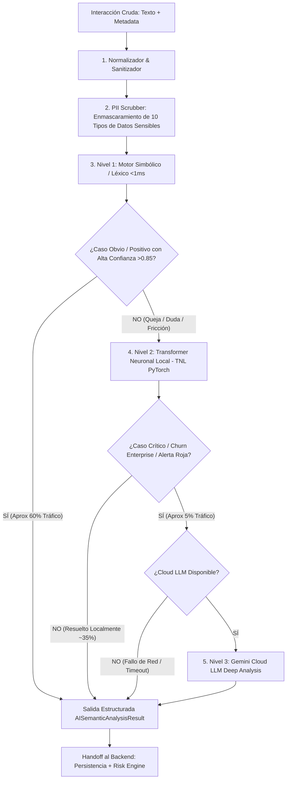

# 🧠 Plan de Implementación: AI & Data Pipeline Architect
**Proyecto 6 — Monitor de Sentimiento de Clientes y Alertas de Riesgo de Abandono (Churn)**

*Guía técnica del pipeline de datos, anonimización PII, arquitectura de inferencia en 3 niveles (Léxico -> Transformer Neuronal Local -> Cloud LLM), scheduler de automatización y optimización de contexto.*

---

## 🎯 1. Objetivo y Responsabilidades del Rol

Como **AI & Data Pipeline Architect**, tu misión es garantizar un procesamiento de lenguaje natural de alta precisión, seguro, estructurado y con disponibilidad del 100%.
Tus responsabilidades principales son:
1. **Pipeline de Ingesta & Limpieza PII:** Sanitizar el texto y enmascarar datos personales (emails, teléfonos, cédulas, tarjetas, cuentas bancarias, IPs, credenciales, direcciones y nombres) antes de cualquier inferencia para cumplir con Habeas Data / GDPR y optimizar el consumo de tokens.
2. **Arquitectura de Inferencia en Cascada de 3 Niveles:**
   * **Nivel 1 (Léxico / Simbólico <1ms):** Resuelve el ~60% del tráfico obvio y positivo a costo \$0 y 0 MB RAM.
   * **Nivel 2 (Transformer Neuronal Local - TNL ~20ms):** Procesa el ~35% de quejas y fricciones complejas usando una red neuronal local en PyTorch sin salir a internet.
   * **Nivel 3 (Cloud LLM - Gemini ~1500ms):** Escalado exclusivo para el ~5% de casos críticos (amenazas de Churn Enterprise de alto valor).
3. **Contrato Estricto de Salida:** Generar el JSON validado con Pydantic (`sentiment`, `emotion`, `friction_points`, `churn_intent`, `confidence`, `evidence`) para el Risk Engine del Backend.
4. **Automatización con Scheduler:** Construir el worker periódico (APScheduler) que procesa registros en lote de forma idempotente con reintentos exponenciales.
5. **Optimización de Tokens y Contexto:** Diseñar system prompts concisos con *few-shot* y delimitadores para evitar alucinaciones y reducir costos de API en un 85%.

---

## 🏗️ 2. Flujo de Datos y Pipeline de IA (Inferencia en Cascada de 3 Niveles)



### 💡 Beneficios de la Arquitectura de 3 Niveles:
1. **Ahorro de hasta un 85% en costos de API:** La nube solo procesa el 5% crítico.
2. **Latencia Sub-milisegundo para el grueso de usuarios:** Descongestiona el pipeline de ingesta masiva.
3. **Comprensión Semántica Real:** El Nivel 2 (TNL) entiende contexto, negaciones complejas y sinónimos sin listas estáticas de palabras.
4. **Disponibilidad Total Garantizada:** Cero caídas ante desconexión de internet o agotamiento de cuotas cloud.

---

## 🔌 3. Contratos de Datos (Pydantic Schemas)

### 3.1 Entrada al Pipeline
```python
class InteractionPayload(BaseModel):
    interaction_id: str
    customer_id: str
    source: Literal["support_ticket", "review", "nps_survey", "chat"]
    message: str
    created_at: datetime = Field(default_factory=lambda: datetime.now(timezone.utc))
    customer_history_count: int = 0
    customer_tier: Literal["Enterprise", "Pro", "Standard"] = "Standard"
```

### 3.2 Salida Estructurada de IA (Entregable para el Backend)
```python
class AISemanticAnalysisResult(BaseModel):
    sentiment: Literal["positive", "neutral", "negative"]
    emotion: Literal["satisfaction", "neutral", "confusion", "frustration", "anger"]
    friction_points: List[Literal[
        "billing_pricing",
        "product_reliability",
        "customer_support",
        "feature_gap",
        "sla_delay",
        "none"
    ]]
    churn_intent: bool
    confidence: float = Field(..., ge=0.0, le=1.0)
    evidence: List[str]
    processing_metadata: Dict[str, Any] = Field(default_factory=dict)
```

---

## 📁 4. Estructura de Archivos del Módulo de IA

```text
ai_pipeline/
├── __init__.py
├── schemas.py                 # Pydantic Schemas v2 (Input, Output, PII Masked)
├── cleaner.py                 # Normalización de texto y Scrubbing de PII (10 entidades sensibles)
├── local_nlp_fallback.py      # Nivel 1 (Motor Léxico) + Nivel 2 (Transformer Neuronal Local PyTorch)
├── prompt_templates.py        # System prompts compactos (<180 tokens) y definición de taxonomía
├── cloud_llm.py               # Nivel 3: Cliente Gemini con timeout (2.5s) y reintentos exponenciales
├── pipeline.py                # Orquestador en Cascada de 3 Niveles (Cleaner -> N1 -> N2 -> N3 -> Validator)
└── scheduler_ingestion.py     # Worker periódico con APScheduler e idempotencia transaccional
```

---

## 🧪 5. Validación sobre los 12 Casos de Prueba Obligatorios

| # | Caso de Prueba | Nivel de Inferencia Óptimo | Resultado Esperado |
|---|---|:---:|---|
| 1 | Mensaje positivo | **Nivel 1 (Léxico)** | `sentiment: positive`, `churn_intent: false` |
| 2 | Frustración por soporte | **Nivel 2 (TNL)** | `sentiment: negative`, `friction: [customer_support]` |
| 3 | Intención de cancelación | **Nivel 2 / Nivel 3** | `churn_intent: true`, `emotion: anger` |
| 4 | Sarcasmo / Ironía | **Nivel 2 (TNL)** | `sentiment: negative`, `emotion: frustration` |
| 5 | Mensaje vacío / Ruido | **Nivel 1 (Léxico)** | `sentiment: neutral`, `friction: [none]` |
| 6 | Interacción duplicada | **Scheduler** | Descarte por control de idempotencia |
| 7 | Datos sensibles (PII) | **Cleaner** | Enmascaramiento de 10 entidades (`[TAG_MASKED]`) |
| 8 | Caída de Cloud LLM | **Nivel 2 / Nivel 1** | Conmutación instantánea local (0 downtime) |
| 9 | Respuesta JSON rota | **Pydantic** | Captura y autocorrección / fallback |
| 10 | Cliente recurrente | **Pipeline** | Preservación de metadata para Backend |
| 11 | Texto extenso (+2000 chars) | **Cleaner/Pipeline** | Extracción de citas clave y evidencias |
| 12 | Recuperación de error | **Scheduler** | Reintento automático en estado `ERROR_RETRY` |
