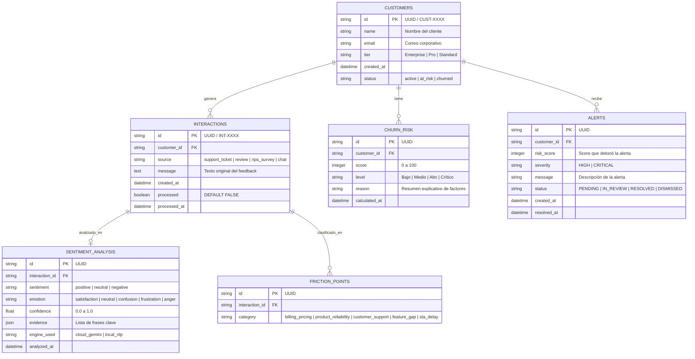

# 🛠️ Plan de Implementación: Backend & Core Engineer
**Proyecto 6 — Monitor de Sentimiento de Clientes y Alertas de Riesgo de Abandono (Churn)**

*Guía técnica y de arquitectura para el desarrollo de la capa de persistencia, lógica de negocio, motor de riesgo determinista, sistema de alertas y API REST.*

---

## 🎯 1. Objetivo y Responsabilidades del Rol

Como **Backend & Core Engineer**, tu misión es garantizar la robustez, integridad de datos, rendimiento y consistencia transaccional del sistema.
Tus responsabilidades principales son:
1. **Modelado y Persistencia de Datos:** Diseñar y gestionar el esquema relacional de base de datos (compatible con SQLite WAL / PostgreSQL) con integridad referencial.
2. **Motor de Riesgo de Churn Determinista (Risk Engine):** Implementar la lógica matemática de ponderación de riesgo (0–100 puntos) a partir de las señales estructuradas entregadas por la IA.
3. **Gestión Transaccional de Alertas:** Disparar, registrar y actualizar estados de incidentes críticos (`PENDING`, `IN_REVIEW`, `RESOLVED`, `DISMISSED`) con prevención de fatiga de alertas (*cooldown*).
4. **API RESTful (FastAPI):** Exponer endpoints documentados en OpenAPI con validación estricta de schemas Pydantic para el consumo del Frontend y del Scheduler de ingesta.
5. **Robustez y Gestión de Fallos:** Idempotencia en inserciones, manejo de transacciones atómicas y logs estructurados.

---

## 🏛️ 2. Esquema Relacional de Base de Datos (6 Tablas)



---

## 🧮 3. Algoritmo del Risk Engine (Cálculo Determinista de Churn)

> [!IMPORTANT]
> **Principio de Separación:** La IA no calcula el score numérico. El Backend recibe las variables de la IA (`sentiment`, `emotion`, `friction_points`, `churn_intent`) y la metadata del cliente para calcular el score con la siguiente fórmula documentada:

### 3.1 Tabla de Ponderaciones
| Factor Evaluado | Condición | Puntos Asignados |
|---|---|---|
| **Sentimiento Negativo** | `sentiment == "negative"` | `+20 pts` |
| **Emoción Crítica** | `emotion in ["frustration", "anger"]` | `+20 pts` |
| **Intención Explícita de Cancelar** | `churn_intent == True` | `+30 pts` |
| **Problema Recurrente** | Interacciones negativas previas $\ge 2$ en últimos 30 días | `+15 pts` |
| **Fricción con Soporte / SLA** | `"customer_support"` o `"sla_delay"` en `friction_points` | `+10 pts` |
| **Señal Reciente** | Feedback generado en las últimas 24 horas | `+5 pts` |

$$\text{Score Total} = \min(100, \sum \text{Puntos Asignados})$$

### 3.2 Escala de Clasificación y Reglas de Alerta
* **0 – 29 pts (Bajo):** Cliente saludable. No se generan alertas.
* **30 – 59 pts (Medio):** Riesgo moderado. Registro de monitoreo.
* **60 – 79 pts (Alto):** Riesgo elevado. Alerta automática con severidad `HIGH`.
* **80 – 100 pts (Crítico):** Riesgo inminente de fuga. Alerta automática con severidad `CRITICAL` y notificación prioritaria.

---

## 🔌 4. Contratos de la API REST (FastAPI)

### 4.1 Ingesta de Feedback Manual / Batch
* `POST /api/interactions`
  * **Body:**
    ```json
    {
      "customer_id": "CUST-1042",
      "source": "support_ticket",
      "message": "Llevo 3 días con el sistema caído y nadie me responde el ticket."
    }
    ```
  * **Respuesta (201 Created):** Objeto interacción creado con `processed = false`.

### 4.2 Métricas y KPIs para el Dashboard
* `GET /api/analytics/kpis`
  * **Respuesta:** Total clientes, % sentimiento positivo/negativo, NPS estimado, casos críticos activos.
* `GET /api/analytics/sentiment-trend?days=30`
  * **Respuesta:** Serie temporal de volumen de sentimiento diario (Positivo, Neutro, Negativo).
* `GET /api/analytics/friction-distribution`
  * **Respuesta:** Conteo acumulado por categoría de fricción (Facturación, Soporte, Bugs, etc.).

### 4.3 Gestión de Casos de Alto Riesgo y Alertas
* `GET /api/churn/high-risk`
  * **Respuesta:** Lista de clientes con score $\ge 60$, ordenados por severidad descendente con detalles de causa y evidencia.
* `GET /api/alerts`
  * **Query params:** `status=PENDING&severity=CRITICAL`
  * **Respuesta:** Lista paginada de alertas activas.
* `PATCH /api/alerts/{alert_id}`
  * **Body:** `{ "status": "RESOLVED", "resolution_notes": "Se contactó al cliente y se ofreció 1 mes gratis." }`
  * **Respuesta (200 OK):** Alerta actualizada con timestamp de resolución.

### 4.4 Health Check & Diagnóstico
* `GET /api/health`
  * **Respuesta:** Estado de la Base de Datos, conectividad de Scheduler y versión de la API.

---

## 📁 5. Estructura de Archivos Recomendada para Backend

```text
backend/
├── __init__.py
├── config.py                 # Pydantic BaseSettings (DB URL, umbrales de score, logging)
├── database/
│   ├── __init__.py
│   ├── connection.py         # Motor SQLAlchemy / SQLite WAL connection pool
│   ├── models_db.py          # Declaración de tablas ORM / Schemas SQL
│   └── repository.py         # Operaciones CRUD, consultas analíticas y transacciones
├── services/
│   ├── __init__.py
│   ├── risk_engine.py        # Cálculo determinista de Churn Risk Score
│   ├── alert_service.py      # Lógica de emisión, deduplicación y cooldown de alertas
│   └── customer_service.py   # Gestión de estados de clientes
├── api/
│   ├── __init__.py
│   ├── schemas.py            # Pydantic Request/Response DTOs
│   ├── routes_interactions.py
│   ├── routes_analytics.py
│   ├── routes_alerts.py
│   └── main.py               # Instancia de FastAPI, middlewares CORS, routers
└── tests/
    ├── test_db_repository.py # Pruebas de persistencia e integridad referencial
    ├── test_risk_engine.py   # Pruebas unitarias de la fórmula matemática de Churn
    └── test_api_routes.py    # Pruebas de endpoints REST con TestClient
```

---

## 🧪 6. Plan de Pruebas Unitarias e Integración

1. **Test de Fórmula de Churn:** Validar que los casos con sentimiento negativo + frustración + intención de cancelación sumen exactamente 70 pts (Alto), y con recurrencia alcancen 85 pts (Crítico).
2. **Test de Idempotencia:** Intentar procesar 2 veces la misma interacción y verificar que no se dupliquen registros en `sentiment_analysis` ni en `alerts`.
3. **Test de Transaccionalidad:** Simular fallo a mitad de guardado y verificar que la base de datos ejecuta `ROLLBACK` sin dejar datos huérfanos.
4. **Test de Endpoints:** Validar códigos de respuesta `200`, `201`, `400` y `404` con validaciones de schemas en FastAPI.
