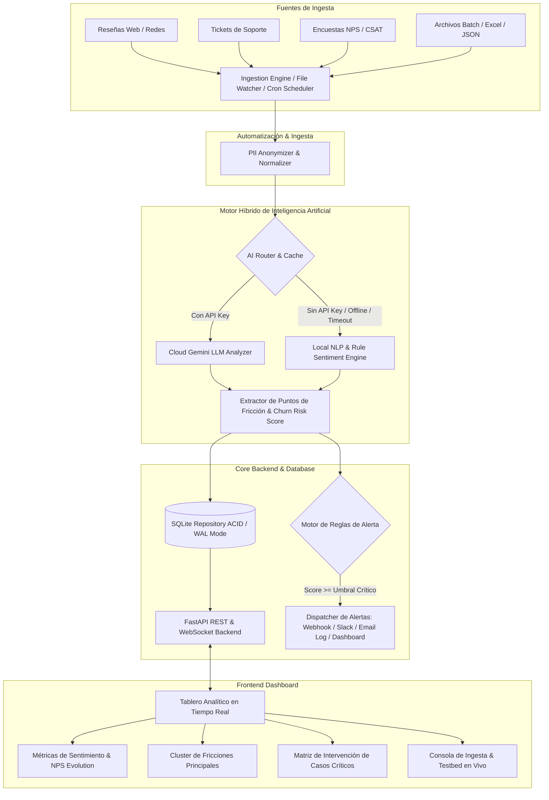

# Plan de Implementación: Monitor de Sentimiento y Alertas de Churn (Proyecto 6)

Este plan detalla la arquitectura, componentes y estrategia de ejecución para el **Proyecto 6: Monitor de Sentimiento de Clientes y Alertas de Riesgo de Abandono (Churn)**, desarrollado con mentalidad de equipo de ingeniería senior (Backend & Core, AI & Data Pipeline, Frontend & Integration).

---

## 👥 Estructura del Equipo Senior y Responsabilidades

| Rol | Responsable Principal | Foco de Trabajo |
|---|---|---|
| **Backend & Core Engineer** | Lógica de Dominio, Base de Datos & API | Repositorio ACID, modelos Pydantic, endpoints FastAPI, sistema transaccional de alertas, manejo de fallos y concurrencia. |
| **AI & Data Pipeline Architect** | Pipeline NLP, Ingesta & Resiliencia | Motor Híbrido de IA (Cloud Gemini + Fallback Local NLP/Heurísticas), PII Scrubbing, Extracción de fricción, Modelo de Riesgo Churn (0-100%), Deduplicación. |
| **Frontend & Integration Lead** | UI/UX Analítica & Automatización | Dashboard reactivo en tiempo real con KPIs, visualización de fricciones y matriz de churn, disparador de acciones de retención, automatización de ingesta. |

---

## 🏛️ Arquitectura de la Solución

---

## 🛠️ Componentes y Archivos Propuestos

### 1. Núcleo & Modelos (`core/`)
- `core/config.py`: Configuración mediante variables de entorno (umbrales de alerta, rutas, fallback flags).
- `core/models.py`: Modelos de datos enriquecidos (CustomerFeedback, SentimentAnalysisResult, FrictionCategory, ChurnRiskAssessment, AlertEvent).
- `core/exceptions.py`: Jerarquía de excepciones tipadas.

### 2. Capa de Datos (`database/`)
- `database/db.py`: Conexión SQLite optimizada (modo WAL, PRAGMA foreign_keys = ON).
- `database/repository.py`: Patrón repositorio para persistencia de interacciones, análisis, métricas agregadas y registro de alertas.

### 3. Pipeline de Inteligencia Artificial (`ai/`)
- `ai/pii_scrubber.py`: Limpieza de datos personales (emails, teléfonos, nombres) antes de pasar al motor de inferencia.
- `ai/sentiment_engine.py`: Motor híbrido con estrategia de Fallback automático:
  - **Cloud Provider (Google Gemini API)**: Extracción contextual profunda, detección de sarcasmo, resumen de motivo y score de churn.
  - **Local Rule & Lexical NLP Provider**: Análisis léxico-semántico en español e inglés, análisis de polaridad, detección de palabras clave de baja/cancelación/frustración, cálculo de churn determinista con cero fallas de red.
  - **Cache semántico**: Evita llamadas redundantes para textos similares o idénticos.
- `ai/churn_scorer.py`: Algoritmo ponderado de riesgo de abandono (Severidad de frustración + Valor del cliente / Tier + Reincidencia de fricciones + Urgencia temporal).
- `ai/friction_cluster.py`: Categorización taxonómica de quejas (Facturación/Precios, Bugs/Fallas Técnicas, UX/Complejidad, Soporte Deficiente, SLA/Entregas).

### 4. Automatización & Alertas (`automation/`)
- `automation/watcher.py`: Worker de ingesta periódica y monitoreo de archivos batch / feeds externos.
- `automation/alert_dispatcher.py`: Despachador multi-canal de alertas con control de frecuencia (*cooldown*) para evitar fatiga de alertas.
- `automation/mock_data_loader.py`: Generador de datos sintéticos realistas con casos de borde (clientes Enterprise con amenazas de cancelación, quejas sutiles, comentarios ambiguos, errores de facturación).

### 5. Backend API & Frontend UI (`api/` & `static/`)
- `api/main.py`: Servidor FastAPI con OpenAPI interactivo (/docs), endpoints de ingesta (`POST /api/feedback`), analítica agregada (`GET /api/analytics`), casos de alto riesgo (`GET /api/churn/high-risk`), trigger de retención (`POST /api/churn/action`) y salud del sistema (`GET /api/health`).
- `static/index.html`, `static/app.js`, `static/style.css`: Dashboard moderno, responsivo y visual con gráficos dinámicos, semáforos de riesgo, filtros por fecha/canal/tier y consola de prueba interactiva.

### 6. Suite de Pruebas Automatizadas (`tests/`)
- `tests/test_ai_pipeline.py`: Pruebas de análisis de sentimiento, scrubbing PII, fallback automático en offline y cálculo de churn.
- `tests/test_repository.py`: Pruebas de persistencia ACID, consultas agregadas y transacciones.
- `tests/test_api.py`: Pruebas de integración de endpoints REST y respuestas JSON estructuradas.
- `tests/test_alerting.py`: Pruebas de disparo de alertas, umbrales y cooldowns.
- `tests/test_edge_cases.py`: Pruebas con strings vacíos, emojis, payloads maliciosos, textos gigantes y caracteres especiales.

### 7. Entregables Gerenciales (`DOCUMENTO_EJECUTIVO_GERENCIAL.md`)
1. **Diagrama de Arquitectura de Solución**
2. **Matriz de Riesgos Técnicos y Mitigación**
3. **Definición de Hecho (DoD) y Criterios de Aceptación**
4. **Análisis de Eficiencia y Elección Tecnológica**
5. **Informe de Validación y Métricas de Impacto**

---

## 🧪 Plan de Verificación

### Pruebas Automatizadas
- Ejecutar `pytest tests/ -v` garantizando cobertura superior al 90% en lógica de negocio y pipeline de IA.
- Ejecutar tests de rendimiento y latencia para evaluar el throughput de procesamiento por lote.

### Verificación Manual & Operativa
- Iniciar el servidor FastAPI y abrir el tablero en navegador web.
- Procesar un lote de feedback con el automatizador y verificar la actualización en tiempo real de los gráficos.
- Inyectar un caso crítico de cliente Enterprise y verificar el disparo inmediato de la alerta en el log y en el panel de incidentes.
- Ejecutar una acción de intervención de retención desde la interfaz y verificar el cambio de estado en la base de datos.
